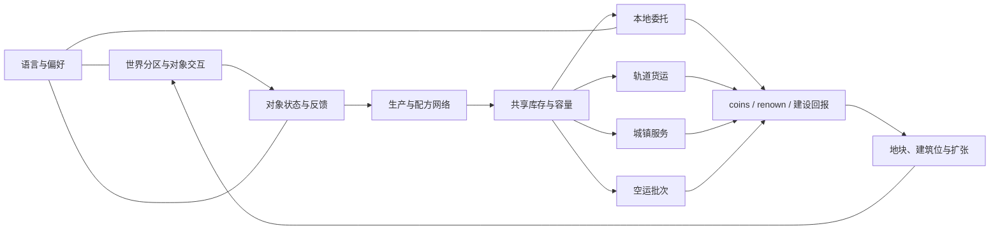
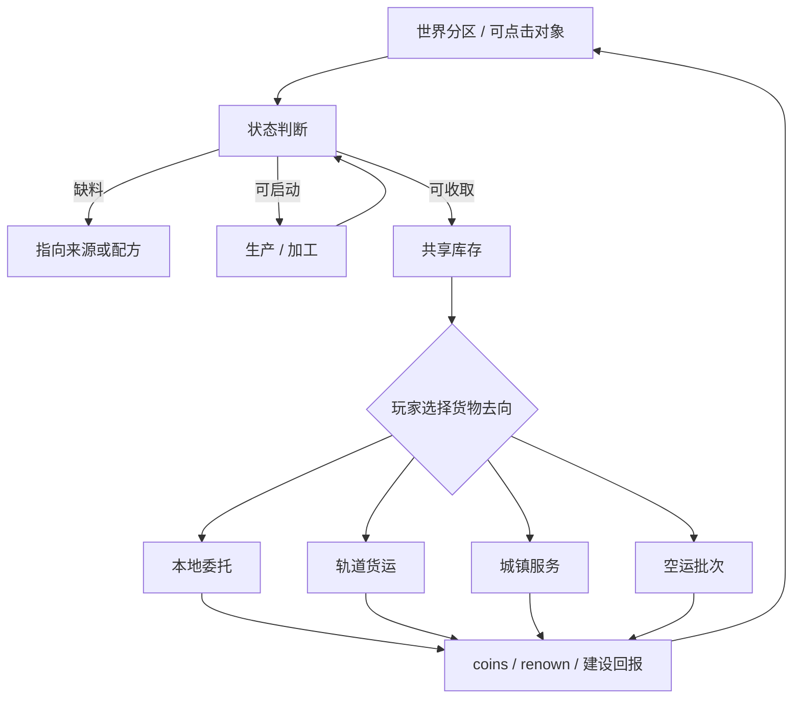
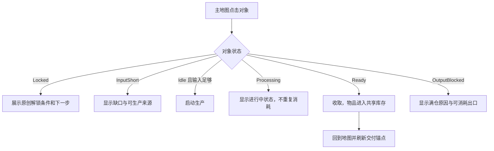
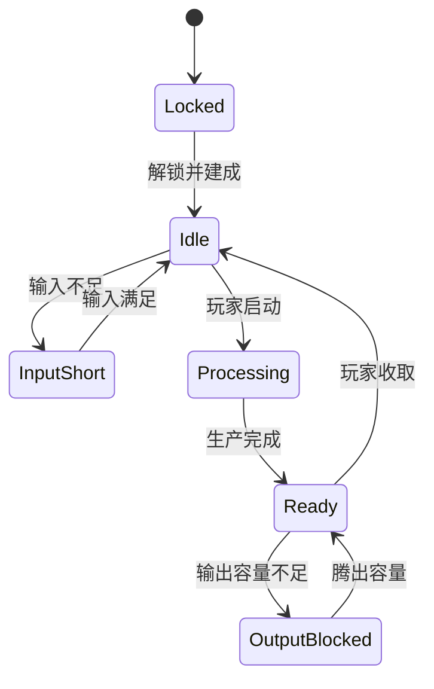

# CORE-FUNCTIONS-001 CityOfAnimals 原创农场小镇核心功能通用策划案

**版本：** CORE-FUNCTIONS.1  
**状态：** 已登记的项目级设计来源；不授予运行时、数值表或资产写入权限  
**责任人：** Codex /root，主策划兼设计 owner  
**适用产品：** CityOfAnimals；Godot 4.6；移动端竖屏 720 x 1280  
**默认语言：** `zh-CN`；Settings 可持久化切换 `en`  
**创建日期：** 2026-07-20  
**上游来源：** `PRODUCT-PLAN.1`、`CORE-LOOP.1`、`FARM-TOWN-DIRECTION.2`、`MARKET-FARMTOWN.2`、`F003-FARM.1`  
**当前前置：** F-003 为 `IMPLEMENTED_PENDING_VISUAL_CAPTURE`；本案不解除其锁，也不授权 F-004 及后续实现。

## 0. 参照边界、目的与非目标

本案以 Township 与 Hay Day 的**品类级功能关系**作为研究输入：可见生产建筑、互相复用的供应链、短中长期交付、城镇消耗与空间扩张。已核验的研究证据记录在 `MARKET-FARMTOWN.2`（2026-07-20；官方资料为中等置信度，录像未核验）。

它转化为 CityOfAnimals 的原创设计规则，不复制第三方的建筑、地图、配方、数值、任务卡、UI 层级、角色、资产、代码或商业化表达。下表是唯一允许的转译范围。

| 品类级观察 | CityOfAnimals 原创转译 | 明确不做 |
|---|---|---|
| 农业、养殖、加工互相供给 | 每个内容包至少复用一项既有材料，并提供一个旧建筑的新去向。 | 转录任何现成食谱、产能、时长、解锁顺序或建筑外形。 |
| 近端订单与中远期货运并存 | 本地委托、轨道货运、空运批次、城镇服务具有不同状态链和回报作用。 | 将同一种订单面板换图标或名称。 |
| 规模来自建筑和区域关系 | 以分区、建筑位、路线、服务和侧区扩展小镇。 | 用新增常驻货币、强制等待或背包惩罚伪造规模。 |
| 建筑可直接表达状态 | 用轮廓、输入/产出图标、状态环、短标签和可点击区域传达下一步。 | 让文字任务列表成为地图玩法的唯一入口。 |

**设计目标：** 将“观察—生产—库存取舍—交付—可见成长”定义成可被后续功能切片实现、配置、测试和验收的核心系统框架。

**非目标：** 本案不创建配方数值、生产时长、容量、奖励金额、商业化、社交、抽卡、正式美术、地图布局、持久化方案或 F-004 的实现任务。这些均须在 F-003 验收后由独立功能说明、配置来源和写入授权确定。

---

# 1. Systems Index / 系统索引

## 1.1 系统列表

| 系统名称 | 优先级 | 层级 | 一句话职责 | 当前状态 | 依赖/边界 |
|---|---:|---|---|---|---|
| 世界分区与对象交互 | P0 | 核心 | 用可点击世界对象承载生产、需求和成长入口。 | F-003 已有单屏对象；F-004 规划多分区。 | 依赖对象状态与 UI；不可用文字列表替代。 |
| 对象状态与反馈 | P0 | 核心 | 让每座建筑清楚表达锁定、缺料、处理中、可收取、满仓等状态。 | F-003 部分实现；项目级规则已定义。 | 所有建筑共用状态语义；状态不能静默失败。 |
| 生产与配方网络 | P0 | 核心 | 把来源、动物、初加工与二段加工连接成共享供应网。 | 首链已实现；多链规划中。 | 每项新内容须复用已有材料；数值待专属 CSV。 |
| 共享库存与容量 | P0 | 核心 | 记录材料与成品，并暴露缺货、满仓与去向选择。 | F-003 已有基础行为。 | 不能作为付费或纯惩罚阻塞；容量规则待功能切片。 |
| 本地委托 | P0 | 核心 | 提供短周期、可立即完成的本地需求出口。 | F-003 已实现，待视觉验收。 | 与货运/服务不能同质化。 |
| 语言与偏好 | P0 | 基础设施 | 所有玩家可见文本走 locale key，中文默认、英文可选持久化。 | F-002 已验收；F-003 延续。 | 后续文本不得硬编码。 |
| 农场分区与 Industry I | P0 | 核心 | 建立农田、养殖、工坊的可读空间和首个双去向材料选择。 | F-004 路线图。 | F-003 必须先接受；须有独立功能/配置来源。 |
| 轨道货运 | P1 | 核心 | 以可见装载、出发、返程的中期清单承接建设型回报。 | F-005 路线图。 | 依赖 F-004 的多货物网。 |
| 城镇服务与 Industry II | P1 | 核心 | 让生产物被可见服务建筑消费，形成不同于订单的回流。 | F-006 路线图。 | 依赖轨道货运与第一组交叉工坊。 |
| 空运批次 | P1 | 核心 | 用预告、多格装载、手动出发与结算构成长目标。 | F-007 路线图。 | 不得提前于多区域供应网。 |
| 地块、建筑位与扩张 | P1 | 辅助 | 将回报转化为可见空间、路线和功能选择。 | F-008 路线图。 | 依赖建设回报与地图分区。 |
| 基础设施升级 | P1 | 辅助 | 对仓储、工坊或货运给出少量可读的长期取舍。 | 规划中。 | 不新增常驻货币；数值待平衡。 |
| 河岸与石作侧区 | P2 | 核心 | 为主供应网增加不脱节的侧资源与建设分支。 | F-009 路线图。 | 依赖扩张和主线内容密度。 |
| 收藏与协作层 | P2 | 辅助 | 在单人循环成熟后提供可选长尾目标。 | F-010 待制作人决策。 | 不得替代单人核心循环。 |
| 保存/离线结算 | P1 | 基础设施 | 记录跨会话生产状态与恢复规则。 | 待独立设计。 | 不能从当前语言偏好持久化推断实现方案。 |
| 埋点与试验 | P1 | 基础设施 | 验证可读性、取舍与回报是否成立。 | 设计字段已列；未实现。 | 不得把设计假设当成数据结果。 |

## 1.2 依赖关系图

**依赖总结：**

- 被依赖最多：`共享库存与容量`，它连接生产、所有交付渠道和建设回报。
- 依赖最多：`地块、建筑位与扩张`，它要求先有可验证的交付价值与世界对象表达。
- 当前关键路径：`F-003 截图接受 → F-004 分区 + 双去向材料 → F-005 轨道货运 → F-006 城镇服务 → F-007 空运 → F-008 扩张`。
- `语言与偏好`为横向基础设施，后续所有玩家文本都必须接入，不能另起硬编码文案。

## 1.3 设计状态追踪

| 状态 | 本项目中的判定 |
|---|---|
| 规划中 | 只有产品路线或品类级关系，无专属功能和配置来源。 |
| 设计中 | 已有功能规则、状态、UI、数据契约、QA 与非目标，但尚未经过制作人评审。 |
| 设计完成 | 具体功能切片拥有经过评审的说明、配置字段、写入边界和验收标准。 |
| 开发中/已实现 | 仅由对应功能任务与回执记录，不由本案推断。 |
| 已验收 | 同时具备行为级证据、规定分辨率下的可审阅视觉证据及完成回执。 |

## 1.4 推荐设计顺序

1. **关闭 F-003 截图门槛**：保护现有首条循环的证据完整性。
2. **F-004 农场分区与 Industry I**：首先验证世界对象可读和共享材料双去向。
3. **F-005 轨道货运**：在多个物品已能竞争库存后，增加中期建设型交付。
4. **F-006 城镇服务与 Industry II**：使小镇“使用货物”，而非只有订单清空货物。
5. **F-007 空运批次**：以跨分区混合准备形成长期目标。
6. **F-008 扩张与建筑位**：将前述回报转换为功能空间。
7. **F-009 侧区**：只在主网稳定后增加资源分支。
8. **F-010 收藏/协作**：等待独立产品决策。

可并行的仅限非运行时工作：在每个前序功能验收后，下一功能的研究、原创美术方向和配置字段讨论可并行；运行时写入仍严格按功能和锁顺序执行。

---

# 2. Core System GDD / 核心系统设计

## 2.1 版本管理与文档简介

| 项目 | 内容 |
|---|---|
| 文档编号 | CORE-FUNCTIONS-001 |
| 设计目标 | 用“可读建筑 + 共享库存 + 分层交付 + 可见扩张”构成原创农场小镇的闭环。 |
| 核心记忆点 | “看一眼地图，我就知道哪座建筑值得先推进，以及这批货该留给谁。” |
| 系统概述 | 玩家直接点击来源、养殖、工坊、订单和物流节点；物资回到共享库存，再由玩家主动选择短、中、长或服务型去向。 |
| 实现状态 | 仅 F-003 首链已实现且待视觉验收；本案其余内容均是设计框架。 |

### 名词解释

| 术语 | 定义 |
|---|---|
| 世界对象 | 主地图中可见、可点击并具有状态的田地、圈舍、工坊、服务建筑或物流节点。 |
| 供应网 | 一项材料在多个生产或交付目标之间流动的关系，而不是单一线性食谱。 |
| 去向/交付地平线 | 本地委托、轨道货运、城镇服务、空运批次等不同准备周期与回报作用。 |
| 可见成长 | 建筑位、路线、可用空间、对象能力或新需求在世界中留下可观察变化。 |
| 状态语义 | 不依赖长文本即可区分锁定、缺料、处理中、可收取、满仓、可交付等情况。 |

## 2.2 系统框架与核心循环

### 模块关系图

### 玩家核心循环图

### 数据流/奖励流

`来源对象 → 原始材料 → 养殖/工坊输入 → 半成品/成品 → 交付目标 → coins、renown、建设回报 → 建筑位/路线/新需求 → 来源对象`

**硬规则：** 任何后续物品都必须能回答“来自哪里、在哪个对象加工、进入哪些至少一个当前去向、完成后改变什么”。若不能回答，它不是核心内容。

## 2.3 UI 界面与交互规则

### 主地图信息层级

| 层级 | 页面/位置 | 展示内容 | 交互逻辑 | 异常与限制 |
|---|---|---|---|---|
| P0 | 世界对象 | 原创轮廓、状态环、输入/产出泡泡、短标签。 | 点按对象打开其上下文操作。 | 必须有稳定触控区；不可只靠文字列表找到。 |
| P1 | 顶部资源槽 | `coins`、`renown` 和当前决策相关的少量库存。 | 仅用于查看；不自动分配物资。 | 不堆叠全部物品，不引入新常驻货币。 |
| P1 | 交付锚点 | 当前本地/物流/服务目标的图标状态。 | 点按进入具体目标；不能替玩家自动交货。 | 未解锁渠道不伪装成可操作任务。 |
| P2 | 对象上下文浮层 | 对象名、输入、输出、状态、一个主行动、短提示。 | 按状态执行启动、收取、定位缺料来源或查看进度。 | 缺料、忙碌、满仓都给恢复路径。 |
| P2 | 交付面板 | 需求、已装载、下一步、回报类型。 | 玩家主动选货、装载、发运或服务。 | 各渠道有独立状态与世界痕迹。 |
| P3 | Settings | 语言、声音和帮助入口。 | `zh-CN` 首启；`en` 可选且持久化。 | 所有显示文本使用 locale key。 |

### 对象交互流程

### 交付 UI 状态

| 渠道 | 出现规则 | 核心操作 | 世界反馈 | 不可替代的差异 |
|---|---|---|---|---|
| 本地委托 | 早期、需求可见时。 | 选择并交付当前所需货物。 | 委托对象完成、短反馈、奖励入账。 | 快速、灵活，主要释放库存和提供近端回报。 |
| 轨道货运 | F-005 后，车厢/清单到站时。 | 分格装载，确认发车。 | 到站、装车、出发、返程、结算。 | 中期多货物准备，回报服务建设/扩张。 |
| 城镇服务 | F-006 后，服务建筑需求出现时。 | 为具体服务节点供货并完成服务。 | 建筑从等待到服务中再到完成。 | 消耗货物的理由是“小镇在使用它”，而非订单换皮。 |
| 空运批次 | F-007 后，预告批次出现时。 | 多格准备、手动发运、完成度结算。 | 预告、装载、离场、结算、下批预告。 | 长期跨分区计划，不能自动发运。 |

## 2.4 系统设计：生产、库存、交付与成长

### 建筑通用状态机

| 状态 | 玩家读到的视觉语义 | 允许操作 | 失败/边界处理 |
|---|---|---|---|
| Locked | 去饱和对象、锁标志和一个可解释条件。 | 查看条件。 | 不暴露未解锁配方细节。 |
| Idle | 对象静止，展示下一输入或可启动提示。 | 输入满足时启动。 | 输入不足时转缺料，不静默失败。 |
| InputShort | 缺少的输入图标与来源方向。 | 定位来源或返回。 | 不扣除部分输入；无来源时标记为设计缺陷。 |
| Processing | 进行中的状态环与轻量动作反馈。 | 查看进度。 | 重复点击不重复消耗；中断规则待保存系统。 |
| Ready | 产出图标与收取提示。 | 收取。 | 满仓时转 `OutputBlocked`，并解释去向。 |
| OutputBlocked | 产出+容量阻塞标记。 | 跳转可消耗出口或腾容。 | 不默认用付费或隐藏操作解除。 |

### 供应网规则

1. **来源具有身份：** 农田、果园、饲料点等来源对象至少服务两个后续需求，或在后续内容中获得第二去向。
2. **养殖先消耗、再产出：** 动物 shelter 的工作状态必须直接展示饲料输入、生产中和产物可收取。
3. **工坊不做孤岛：** 初加工或二段工坊至少复用一类既有材料，并让成品进入一个生产外的目标。
4. **库存是选择地点：** 物品进入同一库存后，系统只能提示去向，不能替玩家默认分配。
5. **新建筑必须增加关系：** 它要么吸收旧物品、要么产出已有系统需要的新物品、要么打开可见路线；仅增加装饰不属于核心功能。

### 内容家族设计（非数值、非最终配方）

| 家族 | 当前/候选原创对象 | 功能身份 | 需要验证的关系 |
|---|---|---|---|
| 农业与饲料 | 现有 `Grainleaf` 来源；F-004 候选果园地块、Feedworks。 | 提供多个链路的基础输入。 | 同一原料要能通向既有烘焙与至少一种动物饲料。 |
| 养殖 | 现有 Willow Pen；F-004 候选第二 shelter、乳品 shelter。 | 消耗饲料，产生不同用途材料。 | 每种产物至少有加工与交付两种前景去向。 |
| 初加工 | 现有 Threadmill；候选压榨、保鲜或乳品处理对象。 | 将原料转为复用半成品。 | 不同来源的材料至少一次在同一工坊或同一交付目标相遇。 |
| 二段工坊 | 现有 Crumbworks；候选手作类对象。 | 产生更高层成品，承接长期目标。 | 不能只把单一半成品再加工一次。 |
| 服务与物流 | Order Board、Rail Freight Yard、城镇服务建筑、Sky Cargo Harbor。 | 提供短中长及服务型去向。 | 各自有独立状态链、世界痕迹和回报作用。 |
| 基础设施 | Storehouse、Guild Workshop、货运调度点（均为后续候选）。 | 以少量长期取舍改变容量/效率。 | 不创建额外硬货币；可见改变必须可解释。 |

### 交付状态链

| 通用状态 | 含义 | 所有渠道共有规则 |
|---|---|---|
| Locked | 功能尚未解锁。 | 展示一个下一步，不显示可误触的伪任务。 |
| Visible | 目标可见但尚未满足。 | 需求物与去向可读。 |
| PartiallyPrepared | 已交/已装部分物资。 | 保留玩家已作出的投入；恢复规则待专属保存设计。 |
| ReadyToResolve | 可确认交付或发运。 | 必须由玩家主动确认，除非未来功能另有专属规则。 |
| Resolving | 服务、运输或结算进行中。 | 世界对象持续呈现进行中状态。 |
| Settled | 回报已结算，下一目标或成长痕迹出现。 | 不可重复领取；刷新规则由各功能配置定义。 |

### 成长与空间规则

- 首批常驻数值资源只使用现有 `coins` 与 `renown`；其他货币、能量、票券和付费资源均未获批准。
- 关键交付的优先回报是**建筑位、路线、区域入口、可见能力或新需求**，而不只是数值提升。
- F-008 之前，不把“土地扩张”伪装为已实现功能；前期只能通过可见解锁门和设计目标表达后续空间。
- 任何建造/扩张条件需要同时规定：前置、可见收益、失败提示、占用空间、与旧系统的供需关系。

## 2.5 UE/客户端实现流程（设计级，非写入指令）

| 环节 | 设计契约 | 失败分支 |
|---|---|---|
| 入口 | 从主地图的世界对象进入，避免先打开全屏文字清单。 | 无效命中不消耗资源；不改变玩家状态。 |
| 数据 | 建筑、物品、配方、交付、分区和 locale 使用稳定 ID。 | 缺失 ID/文本/引用在配置验证中报错，不能用静默默认值。 |
| 状态 | 视图只显示模型提供的状态；视觉反馈不改变逻辑坐标或触控区。 | 刷新失败时保留可读错误/重试路径，不伪造成功。 |
| 事件 | 启动、收取、装载、发运、结算均产生明确事件。 | 重复事件必须幂等或被拒绝并提示。 |
| 刷新 | 只刷新受影响对象、库存、交付锚点与成长提示。 | 中断/重开/离线结算属于保存系统的独立设计范围。 |

## 2.6 配置表需求（字段契约，不创建初始数值）

| 未来表/Sheet | 最小字段 | Owner | 建立门槛 |
|---|---|---|---|
| `Item` | `item_id, family, icon_key, stack_rule, locale_key` | 设计 owner | 每个新物品功能切片。 |
| `Building` | `building_id, district_id, state_rules, input_recipe_ids, output_item_ids, unlock_rule, locale_key` | 设计 owner | F-004 专属配置来源。 |
| `Recipe` | `recipe_id, building_id, inputs, outputs, queue_rule, capacity_rule` | 设计 owner | F-004 及后续工坊功能。 |
| `Delivery` | `delivery_id, horizon, state_rules, demand_pool, reward_type, refresh_rule` | 设计 owner | 分别随本地/轨道/服务/空运功能建立。 |
| `District` | `district_id, sites, entry_rule, visible_benefit, connections` | 设计 owner | 分区/扩张功能。 |
| `Text` | `text_id, zh-CN, en, usage, variable_schema` | 设计 owner | 所有玩家可见新增文本。 |
| `Telemetry` | `event_id, trigger, object_id, state_before, state_after, route_choice` | PM/数据 owner | 获批的数据工作包。 |
| `TodoConfirm` | `question_id, assumption, owner, decision_gate` | 制作人 | 所有未决项。 |

**数值边界：** 本案没有可直接导入运行时的配方、时长、容量、成本或奖励值。数值只能在获批切片的原创 CSV 中提出，并用模拟与试玩校准；不得从参照产品转录。

## 2.7 美术、音乐音效、打点与 QA 需求

### 美术资源需求

| AssetID | 名称 | 类型 | 用途/状态 | 格式 | 优先级 | 依赖/备注 |
|---|---|---|---|---|---:|---|
| ART-CORE-001 | 建筑通用状态环 | UI/世界覆盖层 | 缺料、处理中、可收取、满仓、锁定。 | 原创 SVG/程序化占位 | P0 | 先验证语义，不能借用外部图标。 |
| ART-CORE-002 | 输入/产出物品图标族 | 图标 | 对象气泡、浮层和交付需求。 | 原创 SVG/emoji 占位 | P0 | 正式资产需独立美术任务与来源记录。 |
| ART-CORE-003 | 农业/养殖/工坊轮廓 | 世界对象 | 让分区在主地图一眼可区分。 | 原创 SVG/程序化占位 | P0 | F-004 后才可进入运行时范围。 |
| ART-CORE-004 | 交付锚点状态 | UI/世界对象 | 本地、轨道、服务、空运的不同状态。 | 原创 SVG | P1 | 各渠道不能共享同一种视觉状态机。 |
| ART-CORE-005 | 解锁/成长提示 | UI/效果 | 建筑位、路线或区域出现。 | 程序化反馈优先 | P1 | 视觉子节点使用可中断 Tween/Animation。 |

### 音乐音效需求

| 事件 | 目的 | 优先级 | 当前状态 |
|---|---|---:|---|
| 对象点按 | 确认触控命中。 | P0 | 待后续音频任务。 |
| 生产启动/完成/收取 | 区分状态并强化因果。 | P0 | 待后续音频任务。 |
| 装载/发运/服务完成 | 让不同交付渠道有可听见的身份。 | P1 | 仅设计占位。 |
| 解锁/扩张 | 给可见成长一个正反馈。 | P1 | 仅设计占位。 |

### 功能打点需求（设计意图，未实现）

| Event ID | 触发 | 关键参数 | 用途 |
|---|---|---|---|
| `world_object_tapped` | 点按世界对象。 | `object_id, state` | 验证玩家是否从地图进入核心操作。 |
| `production_start_attempt` | 尝试启动生产。 | `building_id, result, missing_input` | 识别缺料与错误理解。 |
| `item_collected` | 收取产物。 | `item_id, source_building, inventory_before_after` | 观察供应网流向。 |
| `delivery_route_selected` | 选择本地/货运/服务/空运去向。 | `route_id, item_id, route_state` | 验证共享库存是否产生选择。 |
| `delivery_resolved` | 交付结算。 | `route_id, completion_state, reward_type` | 验证不同渠道的完成节奏。 |
| `growth_unlocked` | 新空间/对象/路线出现。 | `unlock_id, source_route` | 验证成长是否可见且可解释。 |

### QA 验收矩阵（设计级）

| 验收维度 | 必须证明 | 典型边界/失败情况 |
|---|---|---|
| 对象可读 | 720 x 1280 中能区分多个关键状态。 | 触控边缘、遮挡、短标签截断、语言切换。 |
| 生产状态 | 每种状态有唯一、可恢复的下一步。 | 缺料、忙碌、重复点按、满仓、锁定。 |
| 共享库存 | 同一物资可在至少两条合法去向之间选择。 | 选择 A 后 B 的可解释延后；库存为零/满。 |
| 交付差异 | 不同渠道有不同准备与世界反馈。 | 部分装载、重复结算、未解锁、重开恢复。 |
| 本地化 | 中文默认与英文切换都完整。 | 缺失 locale key、变量替换、文本溢出、偏好重启后保持。 |
| 商业安全 | 名称、资产、数据和流程均为原创。 | 不可出现外部品牌、截图、URL、复制配方或相似 UI 模板。 |

## 2.8 后期扩展与待确认项

| 事项 | 状态 | Owner | 决策门槛 |
|---|---|---|---|
| F-004 的具体物品、建筑数量、配方与数值 | Pending | 设计 owner | F-003 接受后，专属配置与试玩。 |
| 生产/订单跨会话保存 | Pending | 工程 + 设计 owner | 单独保存方案和恢复 QA。 |
| 轨道、服务、空运的初始节奏与回报 | Pending | 设计 owner | 各自功能说明与原创平衡表。 |
| 扩张成本与建筑位规则 | Pending | 设计 + 经济 owner | F-008 前的模拟/试玩。 |
| 商业化、付费资源、广告或订阅 | Pending | 制作人/业务 owner | 独立商业与合规决策；不在本案范围。 |
| 正式美术与音频 | Pending | 美术/音频 owner | 每个功能的资产合同获批后。 |

---

# 3. Level Design Document / 核心功能地图 LDD

> CityOfAnimals 不是线性关卡游戏。本节按通用 LDD 模板，将“关卡”定义为**主地图上的可玩功能板**，用于约束分区、视线、动线与首次学习节奏；它不是最终地图布局稿。

## 3.1 关卡概述

| 项目 | 定义 |
|---|---|
| 关卡编号 | `LV-CORE-01`（设计锚点，不是运行时关卡 ID） |
| 关卡名称 | 初始工作分区。 |
| 场景主题 | 温暖、可读、忙而不乱的原创动物小镇生产区。 |
| 玩家前置 | 已通过 F-003 的种植、收取、本地委托与语言设置基础体验。 |
| 目标受众 | 新手到轻规划玩家。 |
| 难度定位 | 入门至早期取舍；没有战斗失败或时间强压。 |
| 一句话概述 | 玩家从四个可读对象中观察状态，把一项共享材料决定投入生产、立即交付或为后续目标保留。 |

## 3.2 目标与挑战

| 类别 | 设计定义 |
|---|---|
| 主线目标 | 看懂至少一个可推进对象，完成一次“生产/收取/交付”闭环，并知道一项物资有不止一个潜在去向。 |
| 可选目标 | 提前备货、补足一个缺料对象、为后续交付保留库存。 |
| 成功条件 | 玩家主动完成一次有效对象操作，并能在地图上看出其结果。 |
| 失败条件 | **无硬失败。** 缺料、满仓、未解锁、忙碌均为可恢复状态，必须说明原因与下一步。 |
| 核心机制 | 世界对象点按、建筑状态、共享库存、近端交付、可见成长提示。 |

## 3.3 空间布局与动线

| 区域 | 功能 | 关键地标/对象 | 设计规则 |
|---|---|---|---|
| A. 农业区 | 提供原始材料，建立“来源”认知。 | 田地/果园候选。 | 放在首屏可见范围；可收取和缺料状态要清楚。 |
| B. 养殖区 | 消耗饲料并产出材料，建立投入—等待—收取。 | Willow Pen 与后续 shelter 候选。 | 与农业区视觉相邻，但不复制任何外部布局。 |
| C. 工坊区 | 把材料转为可交付的半成品/成品。 | Crumbworks、Threadmill 与候选工坊。 | 工坊的输入/输出气泡可追溯到 A/B。 |
| D. 本地委托点 | 给早期库存一个快速去向。 | Order Board。 | 从 A/B/C 都能被短距离视觉指向，不用常驻任务栏。 |
| E. 未来物流门 | 提示后续路线，但在未解锁前不当作任务。 | 轨道/空运预留入口。 | 只展示可解释的锁定条件，不展示外部参考风格。 |

**主动作路径：** `A/B/C 中识别状态 → 点按对象 → 生产或收取 → D 交付或保留库存 → 地图出现新状态/成长提示`。

**隐藏内容：** 当前核心循环不设置隐藏奖励。探索感来自“发现新的供需关系”，而不是把必要操作藏在不可见角落。

## 3.4 节奏曲线

| 段落 | 内容 | 情绪强度 | 设计目的 |
|---|---|---:|---|
| 引入 | 一眼看见一个可收取或可启动对象。 | ★☆☆☆☆ | 先让玩家理解世界对象。 |
| 练习 | 启动或收取一次生产。 | ★★☆☆☆ | 建立输入—状态—输出因果。 |
| 上升 | 出现一个缺料对象与一个可完成的本地委托。 | ★★★☆☆ | 引入“下一步”与库存价值。 |
| 高点 | 同一材料可用于两个合理目标。 | ★★★★☆ | 形成首次有成本的选择。 |
| 释放 | 完成一个选择，地图上出现清晰回报。 | ★★☆☆☆ | 确认决策有效，留下下次目标。 |

## 3.5 对象配置（替代敌人/道具表）

| 区域 | 对象类型 | 出现规则 | 玩家动词 | QA 重点 |
|---|---|---|---|---|
| A | 来源对象 | 初始可见或按分区解锁。 | 种植、收取。 | 收取边缘触控、产物入库、缺料/空闲显示。 |
| B | 养殖对象 | 输入满足后可启动。 | 喂养、收取。 | 忙碌不可重复消耗，输入不足可定位。 |
| C | 工坊对象 | 有输入或有可收取产出时强调。 | 加工、收取。 | 输入输出区分、满仓可恢复。 |
| D | 交付对象 | 有需求时可见。 | 查看、交付。 | 需求不足、部分完成、重复结算。 |
| E | 锁定物流对象 | 仅在对应功能前置达成后变为可用。 | 查看条件。 | 不误导为可点击可完成任务。 |

## 3.6 视觉指引与技术要求

### 动线与视觉锚点

- 主要路径通过对象类别、输入/产出图标和状态环建立，不用箭头长文本替代。
- 缺料对象显示缺口图标，完成对象显示产出图标；两者在颜色、形状和动效上可区分，并提供短文本冗余。
- 交付点只显示与当前目标相关的需求，不遮挡主地图对象。
- 使用项目现有 UI 视觉语言；正式建筑、角色、场景资产必须由 CityOfAnimals 原创生产。

### 技术要求（仅约束，不指派代码）

- 720 x 1280 下验证安全区、触控区、图标可读性、中文/英文文本变化与状态刷新。
- 世界对象的动画只作用于视觉子节点，不能改变逻辑坐标、碰撞和触控边界。
- 不依赖外部图片、第三方商业资产或扁平化不可交互大地图。
- 具体性能预算、场景拆分、数据加载和保存策略待对应工程合同。

---

# 4. Difficulty Curve / 难度曲线

> 本品类的“难度”不是敌人伤害或死亡次数，而是玩家对世界状态、供应关系和交付承诺的理解压力。所有下表为设计假设，必须用试玩与埋点验证，不是引用外部产品的数值。

## 4.1 难度轴线定义

| 维度 | 描述 | 测量方式 | 设计原则 |
|---|---|---|---|
| 状态辨识 | 一屏中理解对象是否可推进的难度。 | 玩家能否指出可收取/缺料/处理中/可交付对象。 | 先降低辨识负担，再增加对象数。 |
| 供应分支 | 一项材料的合法去向数量与依赖深度。 | 可选去向数、可追溯生产层数。 | 增加选择，不增加无意义食谱。 |
| 同时目标 | 玩家需要同时考虑的分区/交付目标。 | 同屏活跃目标数与其相互竞争关系。 | 逐步引入，不用弹窗堆任务。 |
| 交付承诺 | 目标从即时到长周期的准备深度。 | 需求物种类、可见状态链、玩家确认步骤。 | 本地先行，货运与空运后置。 |
| 空间规划 | 新区域和建筑位带来的布局与路线选择。 | 可用功能位、解锁前置、旧内容复用度。 | 扩张是奖励，不是早期负担。 |

## 4.2 教学 Ramp：展示 → 练习 → 应用

| 机制 | 首次展示 | 练习机会 | 第一次应用 | 设计验收 |
|---|---|---|---|---|
| 世界对象点按 | 一个可收取/可启动对象。 | 连续观察两个不同状态。 | 从地图完成一次收取或启动。 | 不打开长文本也能完成。 |
| 缺料定位 | 一个明确输入缺口。 | 点按缺料图标查看来源。 | 为对象补足输入并启动。 | 玩家知道“为何失败、去哪恢复”。 |
| 共享库存 | 两个对象都需要同一材料。 | 分别查看两个去向。 | 主动选择先推进其中一个。 | 系统不自动代选。 |
| 本地委托 | 一项可完成需求。 | 查看需求与回报类型。 | 交付一次并看到世界反馈。 | 不是纯奖励弹窗。 |
| 轨道货运 | 到站与空车厢状态。 | 装入第一项物资。 | 手动发车并等待可见返程。 | F-005 后专属验证。 |
| 城镇服务/空运 | 服务需求或预告批次。 | 部分准备。 | 主动完成/发运。 | F-006/F-007 后专属验证。 |

## 4.3 锯齿波进展设计

| 阶段 | 主要新增压力 | 释放方式 | 情绪关键词 |
|---|---|---|---|
| F-003 首链 | 观察与一次生产交付。 | 本地委托完成反馈。 | 明白、安心。 |
| F-004 分区/Industry I | 两条材料去向、多个对象状态。 | 明确缺口定位与短链完成。 | 规划、掌控。 |
| F-005 轨道货运 | 多货物的中期准备。 | 发车、返程与建设回报。 | 期待、完成。 |
| F-006 城镇服务 | 服务建筑需求与生产网交叉。 | 看见城镇使用货物。 | 照料、成形。 |
| F-007 空运 | 跨区混合批次和手动确认。 | 一批完整结算后给予长期成长。 | 筹备、收获。 |
| F-008 扩张 | 空间、建筑位和路线选择。 | 新分区先提供一个简单可读对象。 | 开阔、再出发。 |

## 4.4 各阶段指标

| 阶段 | 状态/选择目标 | 不应出现的压力 | 量化阈值状态 |
|---|---|---|---|
| 教学期 | 一个对象、一种状态、一次直接操作。 | 多重倒计时、不可解释锁定。 | Pending：需可用性测试。 |
| 成长期 | 两到三个对象状态，第一项共享物资。 | 强制最优解、满仓死锁。 | Pending：需试玩与埋点。 |
| 核心期 | 多个分区、近中期交付并存。 | 物流入口同质化、文本信息过载。 | Pending：需 F-005/F-006 专属平衡。 |
| 挑战期 | 长期批次、空间与效率取舍。 | 靠无限物品/货币/等待堆复杂度。 | Pending：需 F-007/F-008 模拟。 |

## 4.5 跨系统交互

| 外部系统 | 对难度感知的影响 | 设计意图 |
|---|---|---|
| 本地化 | 英文文本更长可能改变信息密度。 | 用图标和短标签优先，并逐语言检查溢出。 |
| 库存容量 | 太低会让选择变成惩罚，太高会抹平取舍。 | 先验证可恢复满仓提示，再在独立配置中校准容量。 |
| 扩张 | 新空间既降低拥挤，也增加可管理对象。 | 每次扩张后先给一个简单新关系，不一次塞入多条链。 |
| 保存/离线 | 恢复规则会影响等待与计划感。 | 未设计前不承诺离线收益或自动完成。 |
| 商业化 | 若把压力直接转成付费，会破坏核心选择。 | 当前不设计付费调节或付费跳过。 |

---

# 5. Economy Model / 经济模型

## 5.1 经济目标与反目标

**设计目标：**

1. 让材料、coins 和 renown 共同服务于“选择去向”和“可见成长”，而不是服务无意义囤积。
2. 保持资源流向可解释：玩家知道物品从哪里来、花到哪里去、为何值得保留。
3. 让长期进展来自供应网与空间关系的增加，而非不断新增货币。

**反目标：**

- 不引入硬货币、体力、抽卡、随机保底、交易市场或付费加速作为本案的核心功能。
- 不让满仓、缺料和等待成为逼付费或不可恢复的惩罚。
- 不用第三方产品的数值、稀有度、兑换比、奖励表或商业化结构。

## 5.2 资源类型定义

| 资源 | 类型 | 当前状态 | 主要用途 | 是否交易 | 规则 |
|---|---|---|---|---|---|
| `coins` | 软货币 | F-003 既有。 | 常规建设/功能成本的候选承载。 | 否。 | 具体产消仅由现有或未来原创配置决定。 |
| `renown` | 进度资源 | F-003 既有。 | 解锁条件、区域/能力进展的候选承载。 | 否。 | 不得被普通订单换皮为另一货币。 |
| 原始材料 | 非货币物品 | 首链已有，后续扩展。 | 生产、饲料、加工、交付。 | 否。 | 需要多去向与可解释库存。 |
| 半成品/成品 | 非货币物品 | 首链已有，后续扩展。 | 不同交付渠道、建设/服务需求。 | 否。 | 不允许成为孤岛配方终点。 |
| 建设回报 | 功能进展 | F-005 后候选。 | 建筑位、路线、扩张条件。 | 否。 | 具体形态和数值待专属功能。 |
| 新货币/付费资源 | 未批准。 | Pending。 | 无。 | 不适用。 | 需制作人、业务、合规的独立决策。 |

## 5.3 Faucet / 资源来源映射

| 资源/回报 | 来源 | 频率/数值 | 玩家可控性 | 当前边界 |
|---|---|---|---|---|
| 原始材料 | 来源对象收取。 | Pending 专属配置。 | 高：玩家选择启动/收取顺序。 | 先验证对象状态，不承诺离线产出。 |
| 半成品/成品 | 动物 shelter 与工坊收取。 | Pending 专属配置。 | 高：受输入和队列影响。 | 必须有至少一个可见去向。 |
| `coins` / `renown` | 本地委托；后续各类交付。 | F-003 数值封存；后续待配置。 | 中高：玩家选择交付时机。 | 不从外部作品推导奖励。 |
| 建设回报 | 轨道/服务/空运等后续渠道。 | Pending F-005 后。 | 中：玩家准备与确认。 | 只在对应功能验收后出现。 |

## 5.4 Sink / 资源消耗映射

| 资源 | 消耗方向 | 可选性 | 体验约束 |
|---|---|---|---|
| 原始材料 | 饲料、加工、本地委托、后续物流/服务。 | 有选择。 | 至少两个去向才形成真实决策。 |
| 半成品/成品 | 高层工坊、交付、服务、建设需求。 | 有选择。 | 交付不能自动剥夺玩家的库存选择。 |
| `coins` | 候选的建设/功能消耗。 | 待专属设计。 | 成本需对应可见功能收益。 |
| `renown` | 候选的解锁门槛。 | 非直接消耗或待定。 | 不得变成纯刷取进度条。 |
| 建设回报 | 开启空间/建筑位/路线。 | 待专属设计。 | 必须在地图中留下可见变化。 |

## 5.5 平衡曲线与验证规则

本阶段不填写“每日收入”“时长”“净收入”或任何配方数值。正式平衡前，必须在功能专属 CSV、模拟表和试玩中验证以下关系：

| 验证关系 | 通过定义 |
|---|---|
| 来源 ≥ 可理解的消耗出口 | 新材料上线时至少存在一个当前出口和一个已知的后续出口。 |
| 容量压力可恢复 | 满仓时玩家能看到原因与可行出口，不必付费或重启。 |
| 近端交付不吞噬远端目标 | 本地委托奖励应有即时价值，但不应总是支配更长线路。 |
| 长期目标不堵死短会话 | 未准备完的货运/空运不会让玩家无事可做；仍有本地生产或整理选择。 |
| 旧内容仍有价值 | 新建筑上线后，至少一项旧材料/旧建筑获得新增用途。 |

## 5.6 付费梯度与保底

**不适用 / Pending。** 当前无 PVP、抽取池、随机稀有度或已授权商业化机制，因此不定义 Gini 目标、付费梯度、概率或保底规则。若未来制作人授权商业化研究，必须独立建立合规、经济模拟和体验验证来源，且不得反向破坏本案的核心选择。

---

# 6. Faction Design / 派系设计

> 通用模板要求保留派系设计。本项目当前没有可加入的阵营、敌对关系、PVP 阵营或派系专属能力；为了避免虚构世界观功能，本节明确标记为 **不适用 / 待独立叙事立项**。

## 6.1 派系身份

当前小镇的农田、养殖、工坊、服务与物流是**功能分区**，不是派系。它们不提供玩家选择阵营、阵营数值、阵营冲突或阵营外观套件。

## 6.2 派系 Lore

Pending。若未来需要叙事组织，只能在不改变核心供应网可读性的前提下，由独立世界观/叙事功能来源定义起源、身份和成员；本案不预设任何角色或剧情。

## 6.3 游戏玩法角色

不适用。当前玩法角色由建筑功能承担：来源提供材料、养殖转换输入、工坊加工、服务/物流消耗货物。它们不是可选阵营，也不产生战斗或社交加成。

## 6.4 独特机制

不适用。若未来存在合作层，须在 F-009 之后经过独立产品决策，且只能扩展已验证的单人供应网，不能以阵营机制替代核心内容。

## 6.5 派系关系

不适用。当前没有敌对、联盟、交易或阵营关系矩阵。

## 6.6 视觉/音频特征

不适用。正式美术当前只需区分功能分区和对象状态；不得因“派系”需求引入外部作品的色彩、徽章、角色或建筑表达。

---

# 7. 完成检查与交接

- [x] Systems Index 覆盖当前与路线图中的已知核心系统、状态、依赖和优先级。
- [x] 核心 GDD 对齐 `PRODUCT-PLAN.1` 的可读对象、共享供应网、分层交付、可见成长四项支柱。
- [x] LDD 已将通用关卡模板合法适配为移动端农场小镇主地图功能板，定义区域、动线、节奏、对象、视觉与技术边界。
- [x] Difficulty Curve 以状态理解、供应分支、同时目标、交付承诺和空间规划为轴，并把数值阈值保留给试玩验证。
- [x] Economy Model 完成资源来源/消耗映射，未伪造时长、产出、付费、概率或外部数值。
- [x] Faction Design 被明确标为不适用/待立项，未凭空创建阵营玩法。
- [x] UI、数据字段、美术、音频、埋点、边界情况与 QA 都来自同一核心循环模型。
- [x] 所有第三方参考仅保留系统级抽象；无第三方表达、资产或数值进入设计规则。
- [x] 本文件未改变 F-003 状态，也不构成 F-004 的功能/配置/运行时写入授权。

## 唯一下一步

继续关闭 F-003 的干净 720 x 1280 运行时截图验收。截图被审阅并形成实际完成回执后，才能以本案的 P0 规则为输入，单独创建 F-004 的功能说明、原创配置表、设计回执与写入授权。
