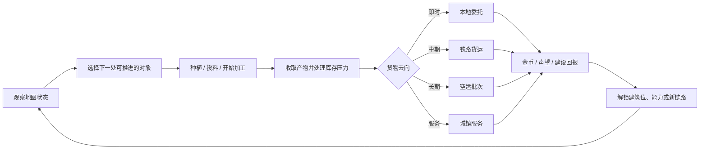
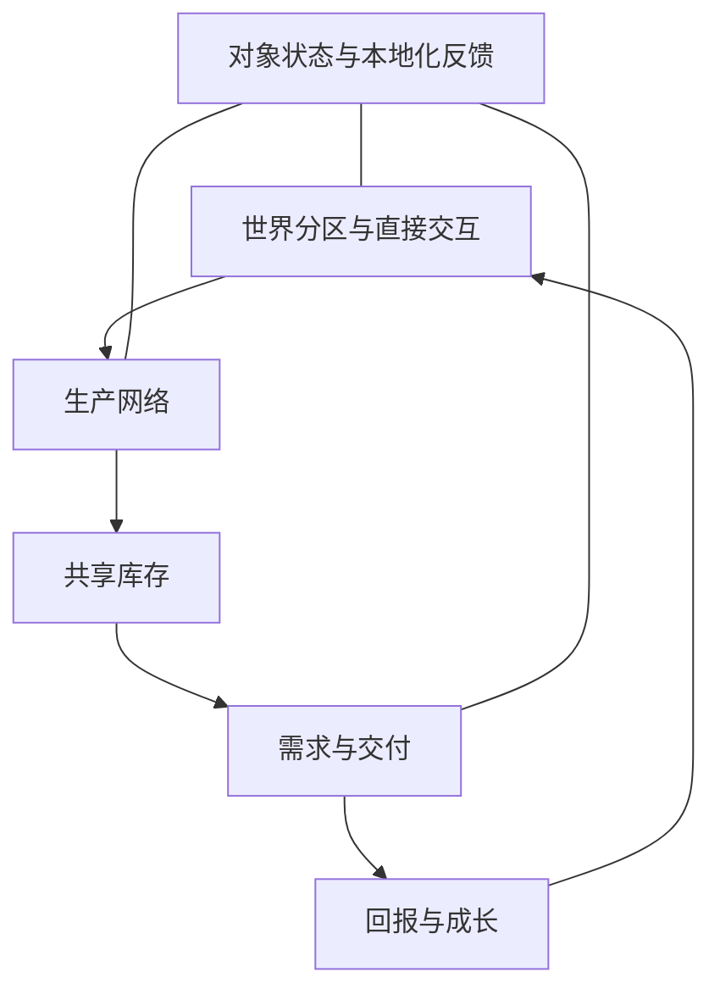
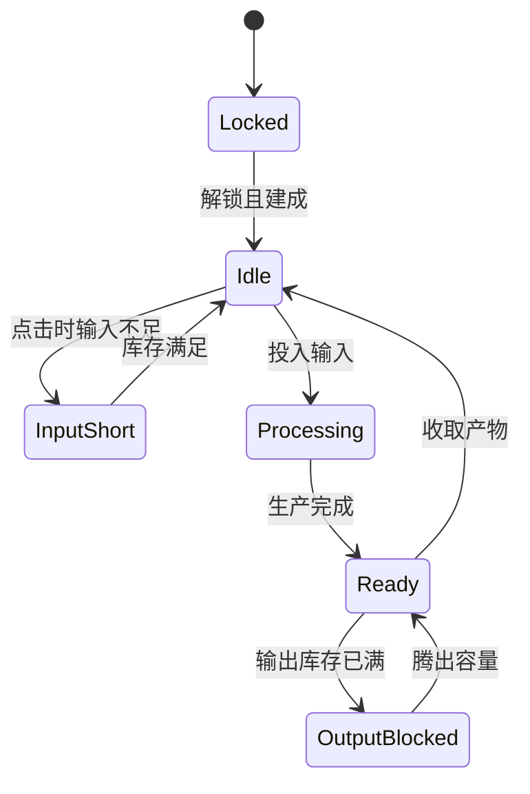
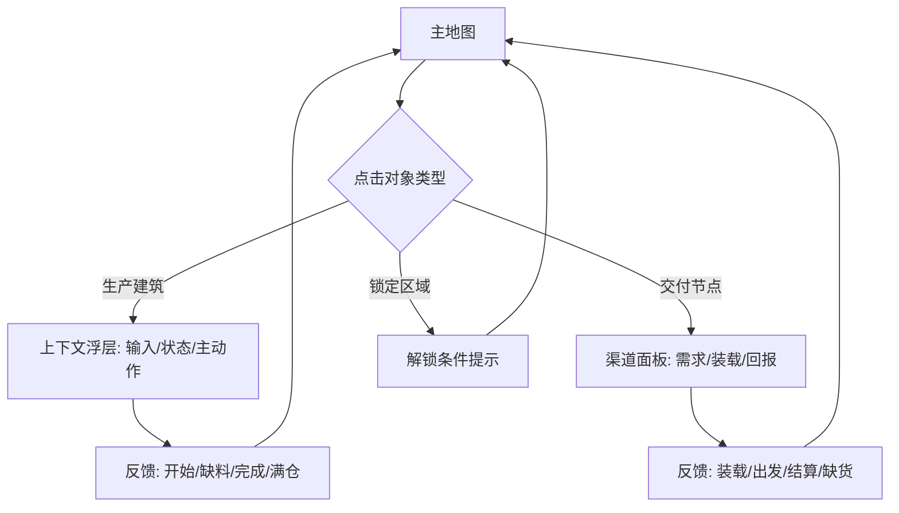

# CORE-LOOP-001 原创农场小镇核心循环与功能策划案

**版本：** CORE-LOOP.1  
**状态：** 制作人已立项的产品功能来源；不授予运行时写入权限  
**责任人：** Codex /root，制作人兼设计 owner  
**目标平台：** Godot 4.6，移动端竖屏 720 x 1280，默认 `zh-CN`，Settings 可持久切换 `en`  
**前置来源：** `MARKET-FARMTOWN.2`、`PLAN-001`、`F003-FARM.1`  
**工程门槛：** F-003 的干净 720 x 1280 截图验收完成前，本文件不得触发 F-004 或任何运行时写入。

## 1. 制作人裁决

**结论：批准。** CityOfAnimals 的核心不是“堆很多订单”，而是让玩家在一张逐渐变丰富的地图上，反复做一个清晰又会升级的问题：

> **我现在拥有的货物，应该立刻交付、投入下一座建筑，还是留给更远的目标？**

### 玩家体验与单一记忆点

| 项目 | 定义 |
|---|---|
| 玩家应感到 | “我的小镇是活的：每座建筑正在缺料、工作、等待我收取，且我能一眼看出下一步。” |
| 单一记忆点 | **看一眼地图，就能做出下一次生产或发运选择。** |
| 主要决策 | 同一批库存投向即时收益、生产链推进、分层货运或空间成长。 |
| 不增加 | 第三种常驻货币、换皮订单栏、强制社交、无意义倒计时、只加数值不改玩法的升级。 |

## 2. 核心循环

### 每轮的玩家行为

| 阶段 | 玩家在做什么 | 必须在画面上读到什么 | 系统结果 |
|---|---|---|---|
| 观察 | 扫一眼农田、圈舍、工坊、物流点与库存 | 哪个对象可收取、缺料、正在工作、被库存阻塞 | 形成下一步计划，而不是先打开文字菜单。 |
| 选择 | 决定让共享原料服务哪条链 | 该动作消耗什么、产出什么、会占用什么机会 | 让“做什么”比“点哪里”更重要。 |
| 投入 | 种植、投料、启动加工或安排服务 | 输入图标进入建筑；状态从空闲转为处理中 | 生产链推进。 |
| 收取 | 领取完成品，或先清掉阻塞库存 | 完成气泡、状态环、库存变化与失败原因 | 产物回到共享库存。 |
| 路由 | 选择本地、铁路、空运或城镇服务 | 每条渠道的准备程度、已装载量与回报类型 | 同一批货产生真实取舍。 |
| 成长 | 获得回报，开启建筑位、能力或新需求 | 新区域/建筑位/效率点出现可见变化 | 地图变得更丰富，下一轮的决策空间变大。 |

### 三个时间尺度（不使用参考作品数值）

| 尺度 | 玩家目标 | 核心体验 | 对应功能 |
|---|---|---|---|
| 即时循环 | 让一个地图对象进入或完成工作 | 点击后立即理解因果；少量等待可被其他建筑填补 | 农田、圈舍、工坊、库存。 |
| 单次会话循环 | 完成至少一个交付并为下一个目标备货 | “现在交”与“留货”的权衡 | 本地委托、铁路清单、城镇服务。 |
| 长线循环 | 让小镇新增一处可见能力或一条路线 | 新建筑使旧物品有新用途，旧建筑也被再次需要 | 空运、扩张、基础设施、侧区。 |

## 3. 核心功能模块

| 模块 | 存在理由 | 核心规则 | 最小可玩证明 | 明确不做 |
|---|---|---|---|---|
| 世界分区与直接交互 | 让小镇首先像一个地方，而不是表格 | 农田、养殖、工坊、城镇、物流以可点击世界对象呈现；每个对象有短标签和状态图标。 | 玩家无需打开常驻列表，就能点到一个可推进对象。 | 照抄任何参考地图、建筑轮廓或界面层级。 |
| 生产网络 | 制造共享原料的取舍 | 每条链至少复用一项已有物品；新建筑必须给已有货物新增去向或需求。 | 一项原料可在两条合法路线间竞争。 | 孤立配方、单用途装饰建筑。 |
| 共享库存 | 使决策发生在同一套货物上 | 库存只记录材料和成品；容量压力必须同时有缺货、满仓和可消耗出口提示。 | 玩家会因准备某目标而暂缓另一个目标。 | 把库存堵塞当作付费或纯惩罚。 |
| 需求与交付 | 让生产有不同的“为什么” | 本地、铁路、空运、城镇服务在准备方式、世界状态和回报作用上不同。 | 玩家能说清某件货为什么不立刻交掉。 | 用同一张文字订单改名伪装成多种物流。 |
| 回报与成长 | 让地图在每轮后产生结构变化 | 优先复用 coins 与 renown；回报解锁空间、建筑位、效率选择或新需求。 | 一次交付后，玩家看见新的能力/位置/路线。 | 新增冗余货币、只提高数字的常规升级。 |
| 状态与反馈 | 把规则变成可读画面 | 所有对象在成功、缺料、忙碌、完成、满仓、锁定时给出图形与短文本反馈。 | 玩家知道失败原因和下一步，而不是看到静默点击。 | 以长段说明文字承载核心交互。 |

## 4. 状态与规则

### 4.1 建筑状态机

| 状态 | 图形表达优先级 | 点击结果 | 设计约束 |
|---|---|---|---|
| Locked | 低饱和轮廓 + 锁 + 解锁条件图标 | 显示下一条可见解锁条件 | 不展示尚未可用的配方细节。 |
| Idle | 建筑本体 + 输入需求泡泡 | 若输入足够则启动 | 不能与 Ready 混淆。 |
| InputShort | 输入图标 + 缺口数量/来源提示 | 定位到可生产来源或保持在当前对象 | 缺料不是静默失败。 |
| Processing | 动作提示/状态环/进度表达 | 告知正在工作，不重复消耗输入 | 视觉动作只作用于视觉节点。 |
| Ready | 产出图标 + 收取提示 | 产物进入库存 | 收取必须有明显的输入输出变化。 |
| OutputBlocked | 产物图标 + 容量阻塞标记 | 指向可消耗渠道或提示腾出容量 | 不可用强制付费或隐藏规则解决。 |

### 4.2 交付状态机

| 渠道 | 状态链 | 玩家问题 | 主要回报作用 |
|---|---|---|---|
| 本地委托 | 可见需求 -> 可交付/缺货 -> 完成 -> 刷新 | “这批货现在换成即时回报吗？” | 短期 coins/renown 与库存释放。 |
| 铁路货运 | 到站 -> 分格装载 -> 可发车 -> 运输中 -> 返回结算 | “我是否为建设性回报保留多种货？” | 建筑/扩张方向的建设性回报。 |
| 空运批次 | 预告 -> 分格装载 -> 手动出发 -> 结算 -> 下批预告 | “我能否提前准备跨分区的混合货物？” | 长线声望和高价值批次回报。 |
| 城镇服务 | 到达需求 -> 建筑服务中 -> 完成回流 | “哪些工坊产品值得给城镇留货？” | 城镇声望、服务能力或新建筑需求。 |

**统一规则：** 未解锁渠道不显示为可用任务；已解锁但材料不足时展示图形缺口；同一货物可进入多个渠道时，不自动替玩家选择去向。

## 5. 地图、UI 与操作

### 5.1 竖屏 720 x 1280 信息层级

| 层级 | 内容 | 规则 |
|---|---|---|
| P0 世界对象 | 建筑轮廓、状态环、输入/产出泡泡、直接点击区域 | 这是默认信息入口；核心操作不能藏进文字卡片。 |
| P1 紧凑资源条 | coins、renown、当前关键库存 | 只显示会改变当前选择的资源；不堆全物品列表。 |
| P1 目标锚点 | 当前可交付的本地/物流/服务目标图标 | 只提示，不替玩家自动派货。 |
| P2 上下文浮层 | 点击某个建筑后的输入、产出、状态、单一主动作 | 一个对象一次只给一个主动作。 |
| P3 设置与帮助 | 语言切换、声音、简短图例 | `zh-CN` 首次启动；英语可切换并持久保存。 |

### 5.2 UI 流程

## 6. 数据、技术边界与本地化

本文件不创建数值或运行时配置。每个实施 feature 在获准后，必须独立建立 CSV 与 locale source；字段采用稳定 ID，初始值只能来自 CityOfAnimals 的原创测试与平衡，不得从参考作品转录。

| 后续配置域 | 最少字段 | Owner | 何时建立 |
|---|---|---|---|
| 建筑内容 | `id, district, input, output, capacity, state_rules, unlock_rule` | 设计 owner | 各 feature 的配置表。 |
| 交付渠道 | `id, horizon, manifest_rules, reward_type, state_rules, refresh_rule` | 设计 owner | 各物流/服务 feature。 |
| 分区与扩张 | `district_id, site_id, unlock_rule, visible_benefit, dependencies` | 设计 owner | F-008 前。 |
| 文本 | `key, zh-CN, en, usage` | 设计 owner | 每个新增 player-visible state。 |
| 埋点 | `event_id, trigger, object_id, state_before, state_after, route_choice` | PM/数据 owner | 首次可玩验证前。 |

### 通用事件契约（设计级，非代码接口）

`object_tapped` -> `production_started | action_blocked` -> `production_ready` -> `item_collected` -> `route_selected` -> `route_resolved` -> `growth_unlocked`

每个事件都必须能在玩家画面上找到对应的原因和结果；后续实现不得只记录日志而没有视觉反馈。

## 7. 功能落地顺序

| 顺序 | Feature | 为核心循环补上的一环 | 必须先证明 |
|---|---|---|---|
| 当前 | F-003 Herd and Local Orders | 第一条共享原料 -> 养殖 -> 加工 -> 本地委托链 | 干净的 720 x 1280 截图验收。 |
| 1 | F-004 Farm District Board and Industry I | 从单屏对象组变为农田、养殖、工坊三个可读分区；加入饲料与更多并行链。 | 同一库存能在至少两条可见路线间形成选择。 |
| 2 | F-005 Rail Freight Yard | 中期多货物清单与往返物流痕迹。 | 装载、出发、返回、建设性结算完整可见。 |
| 3 | F-006 Town Trade Quarter and Industry II | 城镇服务成为生产货物的不同消费出口。 | 服务建筑不是普通订单的换皮。 |
| 4 | F-007 Sky Cargo Harbor | 长期混合批次目标。 | 预告、逐格装载、手动发运、结算完整可见。 |
| 5 | F-008 Land and District Expansion | 让回报改变可用空间、建筑位或路线。 | 解锁后地图和可做选择均发生变化。 |
| 6 | F-009 Riverbank and Stoneworks | 在不断开主生产网的前提下增加侧区。 | 侧区材料同时服务主线建筑或扩张。 |
| 延后 | F-010 Collections and Cooperative Layer | 长线收藏/合作，而非核心循环的替代品。 | 单人核心循环的内容密度已达产品底线。 |

## 8. 验收与 QA 设计要求

| 验收维度 | 通过标准 | 失败示例 |
|---|---|---|
| 一眼可读 | 720 x 1280 下，玩家能区分至少一个可收取、一个缺料、一个处理中和一个可交付对象。 | 所有状态都只靠文字弹窗解释。 |
| 真实取舍 | 一份共享原料至少有两个合理去向，选其一会暂缓另一个目标。 | 任何时候都只有唯一正确按钮。 |
| 渠道差异 | 本地、铁路、空运、服务在准备、状态、回报作用上不同。 | 同一订单面板换四个图标。 |
| 可恢复失败 | 输入不足、忙碌、满仓、未解锁、材料不够均给出短反馈与下一步。 | 点击无响应、状态丢失或只能付费解除。 |
| 成长可见 | 完成一条关键交付后，可见解锁建筑位、路线、能力或新需求。 | 只改变不可理解的数值。 |
| 本地化与可达性 | 新文本有 `zh-CN` 和 `en` key；语言切换持久；触控区域清楚。 | 在代码中写死文本或只验证中文。 |
| 商业安全 | 名称、配方、数值、建筑、地图、UI 层级、资产、角色和代码均为原创。 | 用参考作品截图、录屏、素材或结构作为实现模板。 |

## 9. 设计取舍与待确认项

### 已确定

- 默认采用少资源、强选择：现有 coins 与 renown 是首批唯一常驻数值资源。
- 规模来自建筑关系、可见状态与分区扩张，不来自重复货币或强制长等待。
- 原型阶段允许 emoji/SVG/程序化占位，但正式非 UI 美术需由独立美术任务产出原创资产。
- 所有新内容按 feature 切片落地；本文件不能替代任何 feature 的功能说明、CSV、读档回执、写入授权或行为证据。

### 延后决定

| 事项 | 原因 | 决策门槛 |
|---|---|---|
| 保存/离线结算 | 当前 F-003 只验证语言偏好持久化；生产持久化需单独的数据与恢复策略。 | 首次跨会话生产功能前。 |
| 具体配方、容量、时长、奖励 | 必须来自原创 playtest，而非外部作品。 | 各 feature 的 CSV 平衡阶段。 |
| 社交、合作与活动 | 不能替代单人生产网络的内容密度。 | F-009 验收后。 |
| 正式美术包 | 先锁定可读状态和点击逻辑，避免为错误功能生产资产。 | 每个功能的美术合同获批后。 |

## 10. 交付边界

本策划案是 `CORE-LOOP.1` 的唯一产品来源。它已定义核心循环、模块、状态、UI、数据域、QA 和路线图关系；它**不**定义数值、不创建配置表、不授权 F-004 实现、不解除 F-003 锁，也不改变当前运行时。
