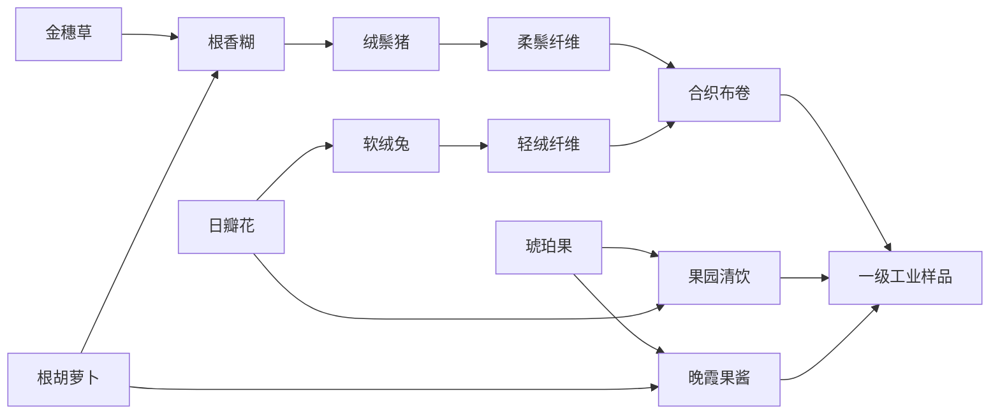
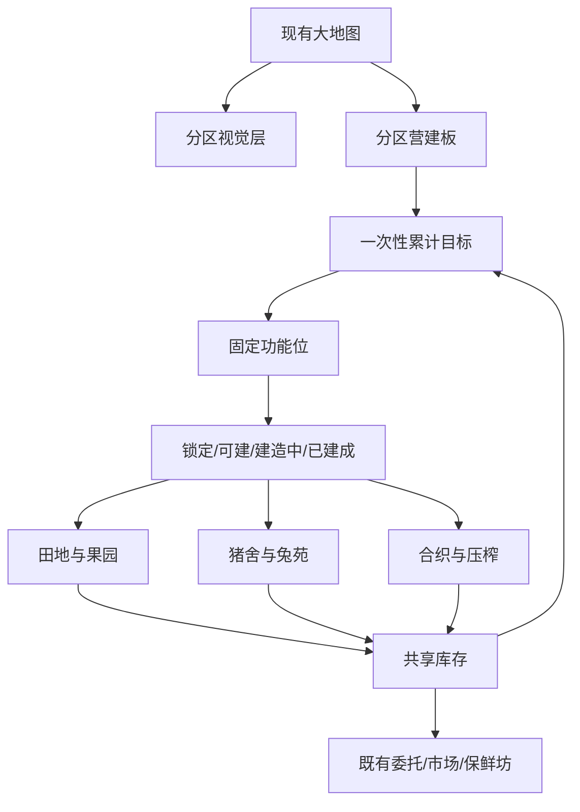

# F-004 动物小镇农场分区与一级工业

**功能版本：** F004-DISTRICT.1  
**文档版本：** V1.0  
**文档状态：** 配置与文档已验证；Figma 可编辑交付阻塞；运行时未授权  
**责任人：** Codex `/root`，制作人兼设计 owner  
**引擎与画布：** Godot 4.6；移动端竖屏 720 x 1280  
**默认语言：** `zh-CN`；Settings 可持久化切换 `en`  
**设计授权：** `docs/receipts/F-004-DESIGN-001.md`  
**运行时基线：** F003-FARM.2 `ACCEPTED FOR PROTOTYPE`

## 版本历史

| 版本 | 责任人 | 评审人 | 状态 | 日期 | 说明 |
|---|---|---|---|---|---|
| V0.8 | Codex `/root` | 制作人自审 | 内容建模 | 2026-07-24 | 将 F-004 路线目标收敛为三个分区、世界内营建板、固定功能位和首个交叉工业网络。 |
| V0.9 | Codex `/root` | 待里程碑评审 | Figma/文档门禁中 | 2026-07-24 | 增加完整 UE、状态机、八张 CSV、保存契约、UI 优先级、商业安全和 QA。 |
| V1.0 | Codex `/root` | 制作人自审 | Figma 阻塞，其余设计门禁通过 | 2026-07-25 | 按最新市场调研流程补充官方、AnySearch、Exa、Reddit 与视频证据；增加 16 个功能入口密度契约、对象状态气泡、生产上下文底栏、独立成品台和配置一致性修正；八表自动校验与 27 页 DOCX/PDF 视觉 QA 通过。 |

## 开发计划

| 阶段 | Owner | 当前权限 | 完成定义 |
|---|---|---|---|
| 策划与配置 | Codex `/root` | 已授权 | 本文与八张 F-004 CSV 通过交叉引用、边界和原创性评审。 |
| UI/UE | Codex `/root` | 已授权 | Figma Design/FigJam 中有可编辑系统、UE、地图、营建板、建造与状态节点。 |
| 文档交付 | Codex `/root` | 已授权 | 通用模板 DOCX/PDF 生成并完成逐页视觉 QA。 |
| 工程 | 未登记 | **未授权** | 只能在新工程只读回执、精确写入集和基线哈希登记后开始。 |
| QA | 未登记 | **未授权** | 工程实现后以真实 720 x 1280 行为与玩家可见证据关闭。 |

## 目录

1. 术语与功能边界  
2. 设计目的  
3. 功能概述  
4. 系统框架与 Figma 登记  
5. 玩家 UE 流程  
6. 参考资料与商业安全  
7. 配置表  
8. 系统逻辑与保存  
9. UI 界面及子玩法  
10. 美术、音频、动效与埋点  
11. 关联拓展  
12. 验收与 QA

---

## 1. 术语与功能边界

| 术语 | 定义 |
|---|---|
| 分区 | 在现有 1800 x 1700 世界中，用地面色、入口图标、镜头锚点和建筑关系形成的功能区域；不是新土地。 |
| 分区营建板 | 地图上的可点击世界对象，汇总三个分区的目标、固定功能位和建造状态。 |
| 固定功能位 | 位置由 CSV 确定、不可自由移动的生产站点；状态为锁定、可建造、建造中或已建成。 |
| 分区目标 | 一次性、累计型、非消耗的学习目标；完成时发放建造资源并开放功能位。 |
| 一级工业 | 农业来源、动物转化和工坊加工首次形成的跨分区供应网络。 |
| 共享材料 | 同一库存物品同时存在两个合理去向，玩家选择一方会短暂延后另一方。 |
| 手动收取 | 计时完成只进入可收取态，不自动进入库存。 |

### 1.1 修订标记

- `P0`：玩家当下必须读懂或完成的内容。
- `P1`：支持决策的次要信息。
- `P2`：深入查看时出现的详情。
- `P3`：装饰、环境叙事和非关键提示。
- `BLOCKED`：条件不足时保持原状态且不扣资源。
- `NOT AUTHORIZED`：设计已存在，但不构成运行时写入许可。

### 1.2 功能边界

本功能只在 F003-FARM.2 已有世界内组织内容和激活既有原创资源。它不扩展世界尺寸，不提供自由摆放，不建设铁路、空运或城镇服务，不新增货币，不复制任何外部商业游戏的地图、建筑、配方、数值或 UI。

---

## 2. 设计目的

### 2.1 玩家记忆点

**“我点开地图里的分区营建板，就知道哪片区域下一步要做什么；建造完成后，木桩原位变成会运转的动物栏或工坊。”**

### 2.2 单一主要决策

**“我现在把共享物资和建造资源优先留给哪个分区？”**

该决策必须由地图对象、物品图标和状态表达成立，不能依赖一页长任务文字。

### 2.3 主要目标

1. 让玩家在 720 x 1280 中通过建筑群、地面边界和图标识别农业、养殖、工坊三个分区。
2. 用世界内营建板串起“了解分区—完成目标—建造站点—启动新生产”的可见成长。
3. 激活现有猪、兔、果园、纺织和压榨资源，不生成新的正式图片。
4. 让旧作物、旧饲料、旧保鲜坊和建材进入新关系，而不是增加孤岛配方。
5. 让日瓣花和琥珀果各有两个真实用途，形成第一个可观察的库存取舍。
6. 保持中文首启、英文可选、减弱动态效果、存档迁移和手动收取契约。
7. 在不增加外部图片和常驻文字栏的前提下，让整张地图形成 16 个可辨认功能入口，并让初始视窗稳定看到农业、养殖、工坊中的至少两类活动。

### 2.4 玩家可观察规则

1. 主地图保留 F003-FARM.2 的 1800 x 1700 世界、拖拽相机、12 块田和既有建筑；新增分区层不替换世界。
2. 三个分区在远景也能凭色块、图标和建筑类别区分；长文本只在点开营建板后出现。
3. 营建板是地图对象；玩家先在地图点击它，再查看三个分区及固定功能位。
4. 分区目标只累计玩家在启用后完成的收取/制作，不交走库存，不重复领取。
5. 建造开始前一次性预检金币和建材；任何一项不足都不扣资源，成功后原子扣除并进入计时。
6. 建造完成后站点原位从工地切换为可交互建筑；计时完成不会自动收取产品。
7. 日瓣花可喂兔也可加入果园清饮；琥珀果可做果园清饮也可做晚霞果酱。
8. 猪与兔的两种纤维必须同时存在才能合织布卷，形成跨动物栏的汇合点。
9. 所有新文字来自 `f004_locale.csv`；首次进入为中文，Settings 中英文切换后立即刷新并持久化。
10. 切后台、退出或离线只推进已开始的生长、动物、机器和建造计时，不自动收取、不重复发奖。
11. 点开生产建筑只打开该建筑的上下文底栏，不自动把成品台货物塞进货物屋；成品图标必须由玩家明确点取。
12. 初始 720 x 1280 视窗至少可辨认 7 个功能对象、4 块田、1 个动物栏和 2 个不同状态气泡；完整地图共有 16 个功能入口，不以空地加文字占位制造“内容丰富”假象。
13. 每个建筑常态最多显示 1 个状态气泡，优先级固定为 `仓储阻塞 > 可收取 > 可建造 > 建造中 > 生产中 > 空闲`，避免高密度地图被重复图标覆盖。

### 2.5 次要目标

- 为 F-005 轨道货运准备足够多的物品种类和跨区供需，但本功能不显示可操作铁路。
- 让建筑数量增加时仍保持“点对象就知道下一步”的地图优先体验。
- 让 F003-FARM.2 的既有玩家存档无损升级到 F-004。

### 2.6 非目标

- 不扩地、不自由摆放、不旋转建筑；这些属于 F-008。
- 不实现铁路、空运、城镇服务、合作、交易市场、付费加速或商业化。
- 不新增常驻货币、体力、票券或付费资源。
- 不改变既有 F003 作物、动物、机器、委托和市场的封存数值。
- 不使用参考游戏截图、名称、角色、建筑轮廓、UI 布局、配方或数值。

---

## 3. 功能概述

### 3.1 内容包

| 类型 | 数量 | 内容 |
|---|---:|---|
| 分区 | 3 | 丰收花园、草坡牧场、匠作长街 |
| 世界内入口 | 1 | 分区营建板 |
| 可建固定功能位 | 5 | 琥珀果园、绒鬃猪舍、软绒兔苑、合织工坊、果香压榨坊 |
| 新来源 | 2 | 日瓣花田格作物、琥珀果园 |
| 新动物 | 2 | 绒鬃猪、软绒兔 |
| 新配方 | 4 | 根香糊、合织布卷、果园清饮、晚霞果酱 |
| 新物品 | 8 | 2 原料、1 饲料、2 动物产品、3 成品 |
| 一次性目标 | 4 | 三个分区导入目标和一级工业样品目标 |
| 复用内容 | 11+ | 金穗草、根胡萝卜、青草料、斑点蛋、柔云奶、柔云奶油、根香腌罐、混粮坊、保鲜坊、建材和 7 个既有图片资源 |

### 3.2 世界内容密度契约

F-004 不以继续增加菜单条目来制造体量，而是让现有世界中的 10 个 F003 功能建筑、1 个分区营建板和 5 个新建站点共同形成 **16 个功能入口**。另有 12 块田、动物视觉和装饰地标提供场景层次，但不冒充可交互内容。

| 范围 | 玩家在地图上应直接辨认的内容 | 最低可见标准 |
|---|---|---|
| 初始视窗 | 田格、仓储、至少一个动物栏、至少一个生产建筑、营建板或其状态徽记 | 7 个功能对象、4 块田、2 种状态 |
| 丰收花园 | 田格、粮仓、琥珀果园及相关既有生产入口 | 原料来源和仓储在同一镜头可建立关系 |
| 草坡牧场 | 鸡舍、牛栏、猪舍、兔苑和货物屋 | 至少两种动物同时可见，状态不用文字解释 |
| 匠作长街 | 混粮、烘焙、乳品、保鲜、合织、压榨、市场、委托与营建板 | 工坊轮廓不同，成品/阻塞气泡不互相遮挡 |

密度验收只计算真实可点击或真实产生状态的对象；道路、树、围栏、空建筑剪影和长文本标签不计数。建筑名称常态隐藏，选中后才出现。

### 3.3 供应网络

### 3.4 可见成长顺序

1. 分区营建板初始已存在。
2. 完成“认识丰收花园”后，琥珀果园木桩变为可建造。
3. 完成“照料草坡牧场”后，猪舍和兔苑木桩变为可建造。
4. 完成“准备匠作长街”后，工坊分区亮起；合织工坊和压榨坊仍检查各自建筑前置。
5. 合织工坊要求猪舍与兔苑都已建成；压榨坊要求果园已建成。
6. 玩家收取三种一级工业成品后，营建板完成样品目标并留下全部站点已连通的地图状态。

### 3.5 时间层

| 时间 | 玩家行为 | 设计作用 |
|---|---|---|
| 5—30 秒 | 点营建板、切换分区、镜头定位、查看工地条件。 | 让下一步可见。 |
| 15—70 秒 | 建造、日瓣花、果园、动物和配方计时。 | 形成短期交错等待。 |
| 3—10 分钟 | 完成三个导入目标，决定先建哪一处分区。 | 形成金币和建材取舍。 |
| 10—20 分钟 | 打通猪/兔/合织与果园/压榨/保鲜两条链。 | 证明共享供应网。 |

---

## 4. 系统框架与 Figma 登记

### 4.1 模块关系

### 4.2 权威边界

| 层 | 权威内容 | 禁止内容 |
|---|---|---|
| 配置 | 分区边界、镜头锚点、站点位置、成本、前置、物品、配方、目标和 locale。 | 在视图脚本硬编码数值或字符串。 |
| 模型 | 目标进度、站点状态、资源事务、计时、库存、奖励、保存和迁移。 | 视图直接加货、扣币或完成目标。 |
| 视图 | 渲染分区、对象、图标、面板、动效和输入意图。 | 用动画状态冒充模型状态。 |
| 保存 | schema、目标、站点、来源、计时、库存、偏好和里程碑。 | 离线自动收取或重复发奖。 |

### 4.3 Figma UE & UI/UX Artifact Register

| 图类型 | 可编辑源 | 页面/区段 | 节点 | 版本 | 负责人 | 评审状态 | 覆盖 |
|---|---|---|---|---|---|---|---|
| 系统框架 | [Figma Design](https://www.figma.com/design/uU2Oek5RqFb19CPoGl48lC/Untitled) | 待创建 `CityOfAnimals F004 District Industry I` | `00_System_Framework` | V1.0 | Codex `/root` | `BLOCKED` | 分区、营建、供应网、保存 |
| 玩家 UE 流程 | 同上 | 同上 | `01_Player_UE_Flow` | V1.0 | Codex `/root` | `BLOCKED` | 进入、目标、建造、生产、失败、返回 |
| 主地图 720 x 1280 | 同上 | 同上 | `02_Main_Map_720x1280` | V1.0 | Codex `/root` | `BLOCKED` | 三分区、世界对象、相机锚点、HUD |
| 分区营建板 | 同上 | 同上 | `03_District_Board_720x1280` | V1.0 | Codex `/root` | `BLOCKED` | 分区卡、目标、固定功能位、单主 CTA |
| 建造与对象交互 | 同上 | 同上 | `04_Site_And_Production_States` | V1.0 | Codex `/root` | `BLOCKED` | 锁定、可建、建造、建成、生产、收取 |
| 状态与边界 | 同上 | 同上 | `05_States_And_Edges` | V1.0 | Codex `/root` | `BLOCKED` | loading、empty、disabled、failure、success、interrupted |

**当前门禁：** `BLOCKED: Figma UE attachment`。2026-07-25 已对指定 Design 文件执行三次连接器只读探测，均在 Figma 服务传输层失败；随后检查浏览器控制通道，当前仅能发现未登录的内置浏览器，未发现已连接的 Chrome 通道。Owner 为 Codex `/root`；下一动作是在 Figma 连接恢复后创建并逐项验证上述六个可编辑节点。在此之前，本地低保真图仅用于评审草稿，UI/UE 不可标记设计完成，也不能进入工程写入授权。

---

## 5. 玩家 UE 流程

### 5.1 首次进入 F-004

1. 读取 F003-FARM.2 存档并执行一次 schema 迁移。
2. 不改变既有库存、金币、队列、田格、动物和委托。
3. 地图在分区营建板上方显示一次短暂“新分区可查看”图标，不弹强制长教学。
4. 玩家点营建板，打开分区面板，默认选中丰收花园。
5. 面板只强调当前目标“累计收取 4 份金穗草”，并显示奖励图标。
6. 玩家点“前往查看”，面板关闭，镜头移动到农业锚点；减弱动态开启时立即定位。
7. 玩家从既有田格完成收取，地图上的目标徽记随进度变化。
8. 达成目标后奖励原子发放，果园工地变为可建造。

### 5.2 常规打开营建板

`主地图点营建板 → 分区面板 → 选分区 → 选目标或功能位 → 前往查看 / 开始建造 → 回主地图`

- 面板一次只选中一个分区。
- 分区顶部展示图标、名称、总进度和一个主要下一步。
- 功能位列表用建筑图片、状态图标和成本表达；描述不超过两行。
- 点“前往查看”只移动镜头，不自动启动生产、建造或交付。

### 5.3 分区目标

| 起点 | 事件 | 条件 | 结果 | 失败/返回 |
|---|---|---|---|---|
| 目标未开放 | 前置目标完成 | 满足顺序 | 状态变 active | 无资源变化 |
| 目标 active | 对应物品发生收取事件 | 事件时间晚于 F-004 启用；物品匹配 | 累加到上限 | 重复加载同一事件不得重复累计 |
| 达成 | 最后一项进度达到要求 | 奖励尚未领取 | 原子发币/声望/建材并开放站点 | 容量不足时建材奖励进入安全待领位，不丢失 |
| 已完成 | 再次触发匹配事件 | `repeatable=false` | 不再累计、不再发奖 | 面板只显示完成 |

目标是**非消耗**的“完成过”证明，不从玩家当前库存中扣货，避免与本地委托同质化。

### 5.4 建造固定功能位

1. 玩家在营建板或地图工地查看站点。
2. 模型同时检查目标前置、其他站点前置、金币和全部建材。
3. 任一条件不足：CTA 禁用，缺口图标高亮，点缺口可定位相关来源；不扣任何资源。
4. 全部满足：玩家点“开始建造”，模型一次性扣金币和建材，记录 `construction_finish_at`。
5. 地图工地进入建造中，显示轮廓、进度环和剩余时间。
6. 达时后状态自动变 `built`，但只发放建成反馈，不自动开始来源/动物/机器。
7. 玩家点新建筑，进入它自己的上下文动作。

### 5.5 来源、动物与机器

- 日瓣花作为新作物加入既有 12 块田的作物盘；播种、成长、收获与粮仓满规则继承 F003。
- 琥珀果园建成时有一次可收取状态；收取后必须由玩家点“再次培育”开始下一轮 70 秒计时。
- 猪舍和兔苑继承 F003 动物状态：空腹、生产中、可收取、货物屋满。
- 根香糊追加到混粮坊；合织布卷追加到合织工坊；果园清饮追加到压榨坊；晚霞果酱追加到既有保鲜坊。
- 机器入队时完整预检并原子扣料；成品位阻塞时下一项不穿透。

### 5.6 共享物资取舍

| 物品 | 去向 A | 去向 B | 玩家看到的机会成本 |
|---|---|---|---|
| 日瓣花 | 喂软绒兔，获得轻绒纤维 | 与琥珀果制作果园清饮 | 先喂兔会延后压榨；先压榨会延后合织。 |
| 琥珀果 | 与日瓣花制作果园清饮 | 与根胡萝卜制作晚霞果酱 | 两种一级工业样品竞争同一批果实。 |
| 根胡萝卜 | 与金穗草制作根香糊 | 与琥珀果制作晚霞果酱 | 先喂猪或先完成果酱。 |

### 5.7 中断与返回

- 切后台或退出前保存模型脏状态和 Unix 时间。
- 返回时先迁移，再推进计时，再刷新目标，不自动收取。
- 建造完成、果园成熟、动物就绪、机器成品就绪只产生一个可收取/建成状态。
- 目标完成奖励必须以 `reward_claimed` 保证幂等。
- 正在打开营建板时切换语言，面板原位置重排文字，不关闭、不改变选中分区。

---

## 6. 参考资料与商业安全

### 6.1 2026-07-25 市场调研记录

**本轮决策问题：** 怎样让 F-004 在现有原创资源内更接近成熟农场/小镇经营品类的内容密度、建筑可读性和生产取舍，同时避免复制外部地图、美术、UI 布局、名称、配方和数值。

| 查询族 / 渠道 | 访问状态 | 原始来源与证据层级 | 观察 | 对 F-004 的影响 |
|---|---|---|---|---|
| Hay Day 生产建筑、生产队列、订单 | `PASS: AnySearch discovery + official source` | [Supercell Production Buildings](https://support.supercell.com/hay-day/en/articles/production-building.html)、[Product Making](https://support.supercell.com/hay-day/en/articles/product-making-2.html)、[Truck Orders](https://support.supercell.com/hay-day/en/articles/truck-orders-2.html)；第一方 | 建筑按进度解锁；机器有队列和成品台；缺料、队列满、仓满都保留现场状态；订单承担资源出口。 | 保留“建筑即入口”、横向队列和独立成品台；打开建筑不自动收取；缺口在对象上下文中显示。 |
| Township 农业、工厂、建造、交付 | `PASS: AnySearch discovery + official source` | [Playrix Farming & Production](https://playrix.helpshift.com/hc/en/3-township/faq/15993-farming-production/?l=en)、[How do I find and unlock factories?](https://playrix.helpshift.com/hc/en/3-township/faq/10055-how-do-i-find-and-unlock-factories/?l=en)；第一方 | 作物、动物、工厂逐层形成生产网；解锁条件、建造等待、配方原料和多类交付分工清楚。 | F-004 只做“来源—动物—工坊—本地目标”一级网；铁路/空运继续留给 F-005，不把所有交付压在一个面板。 |
| 制作网络与时间谜题 | `PASS: Exa secondary discovery` | [Machinations Hay Day Crafting Flow](https://machinations.io/community/catalindocs/hay-day-crafting-flow-42410df80b944d2aadf47c03a6969d14)、[Simulation Games — Quirks of Genre](https://stanislav-stankovic.medium.com/simulation-games-quirks-of-genre-adda9939aa3b)；第三方分析 | 原料并行、加工串行，多阶段配方会迅速增加认知负担；共享中间品比单纯增加终端成品更能形成决策。 | 首轮只保留两个共享原料和一个双动物汇合点；营建板一次只强调一个下一步。 |
| 仓储、建材与队列痛点 | `DEGRADED: AnySearch Reddit vertical unavailable; public Reddit fallback PASS` | [Hay Day production buildings discussion](https://www.reddit.com/r/HayDay/comments/1g10lnh/production_buildings/)、[Township barn/material discussion](https://www.reddit.com/r/TownshipGame/comments/1cdb8l2/barn_management_question/)；玩家讨论 | 强制收取会挤爆仓储；建材长期占仓和过多同时施工会让玩家失去当前重点；玩家常把队列/成品台当缓冲。 | 成品台与库存分离；目标奖励容量不足进入待领位；地图和营建板只给一个推荐下一步，不制造并行工地噪音。 |
| 用户提供的视频样本 | `PASS: Bilibili public metadata + 360p temporal sampling` | [BV1gt421M7HN](https://www.bilibili.com/video/BV1gt421M7HN/)、[BV1vK421Y7u9](https://www.bilibili.com/video/BV1vK421Y7u9/)、[BV17r5x63E7a](https://www.bilibili.com/video/BV17r5x63E7a/)；实机画面二手录像 | 高等级场景依靠大量不同轮廓的建筑、成片田地/果树、动物栏和对象上方状态气泡形成丰富感；生产弹层以货架、队列、配方图标和缺料数字为主。 | 新增世界密度契约、单气泡优先级和底部生产上下文；取消常态建筑名和长目标栏。 |
| 用户提供的 YouTube 样本 | `DEGRADED: platform bot verification` | `https://www.youtube.com/watch?v=zgAysNgvDuk`；未取得可核查内容 | `yt-dlp` 要求登录确认；未导出 Cookie，也未据此形成玩法结论。 | 不计入决策证据；后续浏览器桥恢复后可补做复核，但不阻塞当前设计。 |

**冲突处理：**

- 参考产品通过付费加速、付费队列或付费仓储缓解等待；F-004 MVP 不实现商业化，只验证可读性、取舍和手动收取。
- 玩家会把成品台和队列当仓储缓冲；F-004 接受成品台保留货物，但不允许无限堆叠或通过取消队列复制材料。
- Township 强调自由摆放和扩地，Hay Day 强调农场布置；F-004 仍使用固定功能位，F-008 才处理自由建设。
- 录像中的美术、镜头构图、UI 尺寸、图标、建筑布局和数值全部只作类型观察，不进入项目资产或逐项复刻。

**剩余未知：** YouTube 样本与登录态 Reddit 后端尚未恢复；Figma 低保真节点完成后仍需一次制作人视觉评审，确认“丰富但不拥挤”的密度阈值。

### 6.2 设计来源

- `PRODUCT-PLAN.1`：地图对象优先、共享供应网、差异化交付和可见建设四支柱。
- `CORE-LOOP.1`：观察—选择—生产—收取—交付—成长循环。
- `CORE-FUNCTIONS.1`：F-004 先建立分区和双去向，再进入 F-005 物流。
- `MARKET-FARMTOWN.2`：只采用品类级“建筑直接表达状态”和“旧物料获得新用途”观察。
- `F003-FARM.2`：1800 x 1700 大地图、12 田格、双仓储、动物、机器、委托、市场和设置基线。

### 6.3 商业安全转译

| 品类问题 | 本功能原创答案 | 明确禁止 |
|---|---|---|
| 建筑增多后怎样保持可读 | 三个原创分区色层、镜头锚点和世界营建板。 | 复制第三方地图、道路或建筑摆位。 |
| 新内容如何接回旧内容 | 旧作物、饲料、保鲜坊和建材进入新链。 | 转录第三方配方、时长、产量或解锁顺序。 |
| 怎样形成第一处选择 | 日瓣花、琥珀果和根胡萝卜各有竞争去向。 | 复用第三方任务卡、订单版式或文案。 |
| 怎样表现成长 | 固定木桩原位变成功能建筑。 | 使用第三方建筑轮廓、角色、图标或素材。 |

所有新名称、数值、配方和目标均为 CityOfAnimals 原型原创值，只用于本项目试玩校准。

---

## 7. 配置表

所有表位于 `config/tables/`。运行时必须从 CSV 读取；不得在 UI 或逻辑脚本中复制这些值。

### 7.1 `f004_districts.csv`

| 字段 | 类型 | 规则 |
|---|---|---|
| `id` | id | 三个稳定分区 ID。 |
| `kind` | enum | `agriculture`, `animal`, `workshop`。 |
| `anchor_x/y` | float | 镜头定位世界坐标。 |
| `bounds_min/max_*` | float | 分区视觉层和命中边界；须位于 1800 x 1700 内。 |
| `accent_key` | id | 项目色板键，不是硬编码颜色。 |
| `focus_site_id` | id | 营建板“前往查看”的首要对象。 |
| `unlock_rule` | rule | `always` 或目标规则。 |
| `sort_order` | int | 面板顺序。 |
| `name/description_locale_key` | locale id | 中英文完整覆盖。 |

### 7.2 `f004_sites.csv`

| 字段 | 类型 | 规则 |
|---|---|---|
| `id` | id | 与既有建筑同名时必须明确为激活该建筑。 |
| `district_id` | id | 引用 F-004 分区。 |
| `site_type` | enum | `board`, `source`, `animal_pen`, `machine`。 |
| `world_x/y` | float | 沿用现有世界坐标；不可写在视图。 |
| `footprint_w/h` | int | 用于等距底座、遮挡和触控。 |
| `asset_id` | id | 必须存在于 F003-FARM.2 正式运行时清单。 |
| `content_id` | id | 对应来源、动物、机器或营建板。 |
| `initial_state` | enum | `built` 或 `locked`。 |
| `prerequisite_rule` | rule | 支持目标和站点 `AND`，不支持隐式 OR。 |
| `build_coin_cost` | int | 原创原型值；仅模型扣除。 |
| `build_items` | id-count list | `item_id:count`，分号分隔。 |
| `build_seconds` | float | 原创原型建造时长。 |
| `sort_order` | int | 面板顺序。 |
| `name/description_locale_key` | locale id | 玩家文本键。 |

首轮五个可建站点总成本要求玩家完成分区目标并继续使用 F003 委托/市场获得金币；不存在付费货币或自动购买。

### 7.3 `f004_items.csv`

| 字段 | 类型 | 规则 |
|---|---|---|
| `id` | id | 与 F003 物品合并后唯一。 |
| `category` | enum | `crop`, `orchard_crop`, `feed`, `animal_product`, `machine_product`。 |
| `storage_type` | enum | `granary` 或 `storehouse`。 |
| `initial_amount` | int | 仅日瓣花初始为 3，保证可播种且保留一份。 |
| `market_coin_value` | int | 延续 NPC 市场低价释放仓位。 |
| `seed_reserve` | int | 仅田格作物使用。 |
| `icon_key` | id | emoji/SVG/程序化图标键。 |
| `name_locale_key` | locale id | 中英文名。 |

### 7.4 `f004_sources.csv`

| 字段 | 类型 | 规则 |
|---|---|---|
| `id` | id | `sun_petal_field`, `amber_orchard`。 |
| `source_type` | enum | `field`, `orchard`。 |
| `site_id` | optional id | 果园引用站点；田格来源为空。 |
| `seed_item_id` | optional item id | 田格作物使用。 |
| `harvest_item_id` | item id | 进入粮仓。 |
| `grow_seconds` | float | 日瓣花 45 秒；果园 70 秒。 |
| `plant_cost` | int | 田格 1；果园 0。 |
| `harvest_yield` | int | 日瓣花 4；果园 3。 |
| `unlock_rule` | rule | 目标或站点建成规则。 |
| `asset_id` | id | 既有正式运行时图片。 |
| `initial_state` | enum | 田格内容定义为 `available`；果园建成后为 `ready_on_build`。 |
| `name_locale_key` | locale id | 来源名称。 |

### 7.5 `f004_animals.csv`

| 字段 | 类型 | 规则 |
|---|---|---|
| `id` | id | `pig`, `rabbit`。 |
| `site_id` | id | 引用对应已建站点。 |
| `feed_item_id/cost` | item id/int | 入场时原子扣除。 |
| `output_item_id/count` | item id/int | 手动收取进入货物屋。 |
| `duration_seconds` | float | 猪 45 秒；兔 36 秒。 |
| `animal_count` | int | 地图视觉数量。 |
| `animal_asset_id/pen_asset_id` | asset id | 正式清单中已有。 |
| `name_locale_key` | locale id | 中英文动物名。 |

### 7.6 `f004_recipes.csv`

| 字段 | 类型 | 规则 |
|---|---|---|
| `id` | id | 与 F003 配方合并后唯一。 |
| `machine_id` | building/site id | 可引用既有混粮坊、保鲜坊或新工坊。 |
| `input_items` | id-count list | 入队时一次性预检和扣除。 |
| `output_item_id/count` | item id/int | 成品位中的产出。 |
| `duration_seconds` | float | 16—65 秒原创原型值。 |
| `queue_slot` | int | 不超过建筑配置槽位。 |
| `unlock_rule` | rule | 目标或站点建成规则。 |
| `name_locale_key` | locale id | 配方名。 |

### 7.7 `f004_requests.csv`

该表保存一次性分区目标，不是循环订单。

| 字段 | 类型 | 规则 |
|---|---|---|
| `id` | id | 四个目标。 |
| `district_id` | id | 归属分区。 |
| `objective_type` | enum | 首轮仅 `collect_cumulative`。 |
| `requirements` | id-count list | 对启用后的收取事件累计，不扣库存。 |
| `reward_coins/renown` | int | 目标完成时一次发放。 |
| `reward_items` | id-count list | 建造材料；容量不足进入待领奖励。 |
| `unlock_site_ids` | id list | 完成后开放站点。 |
| `repeatable` | bool | 首轮均 false。 |
| `sort_order` | int | 目标链顺序。 |
| `title/description_locale_key` | locale id | 中英文目标。 |

### 7.8 `f004_locale.csv`

列固定为 `key,zh-CN,en`，与 F003-FARM.2 现有语言表一致。必须覆盖分区、站点、物品、来源、动物、配方、目标、页面标题、状态、动作和失败反馈。缺键是配置错误，不使用 locale key 本身冒充玩家文本。

---

## 8. 系统逻辑与保存

### 8.1 配置加载与合并

1. 先加载并验证 F003-FARM.2 九张 CSV。
2. 再加载 F-004 八张 CSV。
3. F-004 `items`, `recipes`, `animals` 合并到对应领域索引；重复 ID 只有明确的“激活既有建筑”路径允许。
4. 全部引用通过后才创建模型；任一缺失 ID、locale、资产或非法规则都使启动测试失败。
5. 配置校验不得静默替换物品、建筑、数值或文本。

### 8.2 分区显示

- 分区边界只用于视觉、镜头定位和对象归类，不限制玩家拖动相机。
- 未开放的匠作长街仍以低饱和轮廓可见，点按只解释一个前置目标。
- 分区色层不得遮挡建筑和状态图标；状态图标优先级高于区域装饰。
- 画面同时出现多个分区时，以边界纹理和图标冗余，不只靠颜色。

### 8.3 目标状态机

`LOCKED -> ACTIVE -> COMPLETE`

- `LOCKED`：上一目标未完成；不累计事件。
- `ACTIVE`：监听被批准的收取事件，以事件唯一 ID 保证幂等。
- `COMPLETE`：发奖一次、开放站点、写入完成里程碑。
- `industry_showcase` 只有前三个目标完成后才激活。

目标进度使用 `min(current + delta, required)`；导入旧库存、市场购买或调试赋值不能计入。

### 8.4 站点状态机

`LOCKED -> AVAILABLE -> CONSTRUCTING -> BUILT`

| 状态 | 允许动作 | 状态出口 |
|---|---|---|
| LOCKED | 查看唯一前置、定位目标 | 所有前置满足 |
| AVAILABLE | 查看成本、开始建造 | 事务成功 |
| CONSTRUCTING | 查看剩余时间 | `now >= finish_at` |
| BUILT | 打开对应来源/动物/机器 | 不回退 |

建造事务顺序：

1. 验证站点为 `AVAILABLE`。
2. 验证全部前置仍成立。
3. 验证金币和全部建材。
4. 一次性扣金币和建材。
5. 写入 `CONSTRUCTING` 与完成时间。
6. 发事件并标记保存脏。

失败发生在第 1—3 步时，资源和状态完全不变。

### 8.5 果园状态机

`LOCKED -> READY_ON_BUILD -> IDLE -> GROWING -> READY`

- 果园建成后给予一次 `READY_ON_BUILD`，让建设回报立即可见。
- 收取前完整检查粮仓能否容纳 3 份琥珀果。
- 收取成功后进入 `IDLE`；玩家点“再次培育”进入 `GROWING`。
- 达时进入 `READY`；不自动收取。
- 粮仓满时保持 `READY`，显示粮仓阻塞。

### 8.6 动物与机器

- 猪和兔复用 F003 动物状态机与货物屋阻塞语义。
- F-004 配方复用 F003 机器队列和成品位，不另建第二套计时逻辑。
- 合织工坊的两个动物材料必须完整预检；不允许先扣一种。
- 压榨坊和保鲜坊同时竞争琥珀果；UI 只提示，不自动保留或分配。

### 8.7 奖励待领位

分区目标奖励中的金币/声望直接发放；物品奖励若目标仓储没有完整空间：

- 目标仍标记完成，避免重复累计。
- `pending_goal_rewards[goal_id]` 保存未领取物品。
- 营建板显示奖励箱图标和所需空位。
- 玩家释放空间后手动领取；一次性全额入仓。
- 不允许部分领取后重复生成剩余数量。

### 8.8 保存与迁移

F-004 在 F003-FARM.2 schema 2 基础上升级到 schema 3，新增：

- `f004_enabled`
- `district_goals[goal_id: progress, state, reward_claimed, seen_event_ids]`
- `sites[site_id: state, construction_finish_at]`
- `sources[source_id: state, ready_at]`
- `f004_animals[animal_id: state, ready_at]`
- `pending_goal_rewards`
- `milestones`
- `selected_district_id`

迁移规则：

1. 保留 F003 的库存、金币、声望、等级、田格、机器、动物、委托、设置和相机位置。
2. 添加 3 份日瓣花到粮仓；只执行一次，由 `f004_starter_grant` 里程碑保护。
3. 营建板为 built；其他五个站点按 CSV 为 locked。
4. 果园原有装饰状态不解释成已建成；只有站点状态决定交互。
5. 离线推进建造、来源、动物和机器计时，但不自动收取、不自动领取奖励。
6. 迁移后立即保存 schema 3；失败时保留原文件并回到安全错误态。

### 8.9 错误与恢复

| 场景 | 保持内容 | 玩家反馈 | 恢复 |
|---|---|---|---|
| 金币不足 | 站点仍 AVAILABLE | 金币图标+缺口数量 | 完成委托或卖余货 |
| 建材不足 | 站点仍 AVAILABLE | 缺少的建材图标 | 完成分区目标 |
| 前置不足 | 站点 LOCKED | 只显示一个最近前置 | 前往对应目标/站点 |
| 粮仓满 | 来源 READY | 产物保留 | 委托、市场或整理库存 |
| 货物屋满 | 动物/机器 READY | 产物保留 | 委托、市场或整理库存 |
| 队列满 | 原料不扣 | 禁用配方 CTA | 收取或等待 |
| 配置缺失 | 不进入可玩场景 | 开发错误日志 | 修复 CSV 后重启 |
| 迁移失败 | 保留旧存档 | 安全错误提示 | 重试或使用备份 |

---

## 9. UI 界面及子玩法

### 9.1 UI 设计优先级

#### 主地图

- **单一主要决策：** 我先前往哪个可推进分区对象？
- **P0：** 可收取/可建/建造中/缺料对象，当前选中对象，一个主行动。
- **P1：** 金币、声望、相关仓储、分区营建板徽记。
- **P2：** 分区边界、镜头定位、进度详情。
- **P3：** 装饰居民、环境气泡和非功能性叙事。
- **明确移除：** 常驻长目标列表、多个同权 CTA、覆盖地图的教学文案。

#### 分区营建板

- **单一主要决策：** 当前应该推进哪个分区目标或固定功能位？
- **P0：** 当前分区、下一项、状态、需求/成本、主 CTA。
- **P1：** 三分区切换、总进度、奖励、站点顺序。
- **P2：** 两行描述、生产关系预览、建造时间。
- **P3：** 装饰插图、已完成历史。
- **明确移除：** 滚动文本百科、外部参考式订单卡、购买按钮、倒计时加速。

### 9.2 页面清单

| 页面 ID | 名称 | 入口 | 退出 | 主要状态 | Figma 节点 |
|---|---|---|---|---|---|
| `F004-MAP` | 三分区主地图 | 启动/返回 | 系统退出/打开面板 | idle、pan、selected、blocked、return | `02_Main_Map_720x1280` |
| `F004-BOARD` | 分区营建板 | 点地图营建板 | 关闭/前往查看/开始建造 | loading、active、empty-safe、complete | `03_District_Board_720x1280` |
| `F004-SITE` | 固定功能位上下文 | 点工地/营建板站点 | 返回地图 | locked、available、constructing、built | `04_Site_And_Production_States` |
| `F004-SOURCE` | 果园上下文 | 点果园 | 返回地图 | ready、idle、growing、blocked | `04_Site_And_Production_States` |
| `F004-PRODUCTION` | 新动物/工坊上下文 | 点建筑 | 返回地图 | hungry/idle、processing、ready、blocked | `04_Site_And_Production_States` |
| `F003-SETTINGS` | 既有设置 | 齿轮 | 保存返回 | zh-CN、en、reduced_motion | 复用 F003 已验收节点 |

### 9.3 主地图与对象状态气泡（720 x 1280）

- 主地图保持大场景为主体；顶部只保留等级、金币、声望和相关仓储，底部保留 F003 导航。
- 建筑常态不显示名称。状态气泡固定在建筑视觉顶部偏右，并随镜头缩放保持可点尺寸。
- 每个建筑最多出现一个气泡；同一视窗最多突出 5 个 P0/P1 气泡，其余状态以低对比轮廓保留，避免“满屏感叹号”。
- 点气泡与点建筑进入同一上下文，不跳转到文字任务清单。
- 选中建筑后，建筑底座高亮，其他分区边界降至 35% 强度；关闭上下文后恢复。

### 9.4 分区营建板布局（720 x 1280）

- 顶部安全区下方：页面标题、关闭按钮、总完成度。
- 第二层：三个 72 x 72 以上分区缩略状态；各自只有分区图标、进度环和一个最高优先状态气泡，选中态再显示名称。
- 中部：当前分区地标图、目标标题、图标化需求进度和奖励。
- 下部滚动区：固定功能位卡，每卡显示建筑图、状态、成本或进度。
- 底部安全区上方：一个 600 x 72 主要 CTA；不可用时仍显示原因。
- 面板内不展示配方百科或完整生产链文字；点功能位后关闭面板并在地图聚焦该对象。

### 9.5 生产建筑上下文底栏（720 x 1280）

生产建筑、动物栏和果园使用同一底部上下文骨架，最大高度 420，不遮住选中建筑本体：

1. **状态头（P0）：** 建筑图标、短名称、当前状态、关闭按钮。
2. **成品台（P0）：** 0—3 个实物图标位；玩家点具体成品才进入仓储。打开面板、切配方或排队都不自动收取。
3. **队列（P0）：** 2—3 个横向槽，正在生产项显示图标和进度环；未开始槽不显示长倒计时文字。
4. **配方带（P1）：** 横向滚动图标；选中后只显示输入图标、拥有数/需求数、产出图标和时长。
5. **主行动（P0）：** 一个“加入生产 / 喂养 / 再次培育 / 收取”动作；条件不足时保留按钮并在对应原料图标显示缺口。

首轮原型用点按选择配方和 CTA 入队，不复制参考产品的拖拽手势。队列取消、重排和付费扩槽不属于 F-004。

### 9.6 地图表达

- 农业分区使用金黄边界纹理和叶片图标。
- 养殖分区使用青绿色边界纹理和爪印图标。
- 工坊分区使用珊瑚色边界纹理和齿轮图标。
- 锁定功能位显示木桩轮廓和锁；可建造显示锤子；建造中显示进度环；建成后只保留生产状态。
- 地图名称只在选中/悬停时出现；常态以建筑形和状态图标为主。

### 9.7 全状态规范

| 状态 | 进入条件 | 表现 | 主要动作 | 返回/恢复 |
|---|---|---|---|---|
| Loading | 配置/存档读取 | 骨架分区与禁用输入 | 无 | 成功进地图；失败安全提示 |
| Empty-safe | 目标表有效但当前无可推进项 | 最近完成对象和计时 | 前往最近完成 | 不制造假任务 |
| Disabled | 条件/金币/建材不足 | CTA 保留但禁用，显示图标缺口 | 前往来源 | 补足后自动刷新 |
| Failure | 原子事务失败 | 短反馈，不改状态 | 重试/定位 | 条件满足后恢复 |
| Success | 目标/建造完成 | 对应地图对象脉冲一次 | 前往新对象 | 反馈结束回普通态 |
| Interrupted | 切后台/退出 | 保存当前状态 | 无 | 回来推进计时并保持选择 |
| Locale switch | 面板打开时改语言 | 原地重排 | 保存返回 | 不改变模型 |

### 9.8 输入与可访问性

- 所有主要触控目标至少 52 x 52 逻辑像素；主 CTA 高度至少 64。
- 地图区拖动阈值沿用 F003 的 12 像素；点工地开始且未超过阈值才打开站点。
- 分区状态不能只靠金/青/珊瑚颜色；同时使用叶片、爪印、齿轮和边界纹理。
- 数量使用图标+数字；失败提供短文本冗余。
- `reduced_motion=true` 时镜头瞬移、停止循环摇摆、只保留一次轻微透明度变化。
- 中文和英文都验证 720 x 1280 安全区、截断、两行限制和 CTA 可读性。

---

## 10. 美术、音频、动效与埋点

### 10.1 运行时资源复用

| Asset ID | 用途 | 当前来源 | F-004 处理 |
|---|---|---|---|
| `plot_sunflower_ready_v1` | 日瓣花成熟田 | F003-FARM.2 正式运行时 | 直接复用 |
| `orchard_apple_v1` | 琥珀果园 | 同上 | 从装饰激活为来源 |
| `animal_pig_v1` / `pen_pig_v1` | 绒鬃猪与猪舍 | 同上 | 激活动物生产 |
| `animal_rabbit_v1` / `building_chicken_coop_v2` | 软绒兔与兔苑占位 | 同上 | 激活动物生产；正式兔苑美术另立任务 |
| `building_textile_v1` | 合织工坊 | 同上 | 从锁定建筑激活 |
| `building_juice_press_v1` | 果香压榨坊 | 同上 | 从锁定建筑激活 |
| `building_grainworks_v1` | 分区营建板占位 | 同上 | 以板牌覆盖层区分，不新增图片 |

兔苑建筑图是已批准的内部占位复用，不宣称正式美术完成；不得把占位视觉验收成最终资产。

### 10.2 新增程序化视觉

- 三种分区地面边界纹理。
- 分区叶片、爪印、齿轮 SVG/程序化图标。
- 锁定、可建、建造中、建成、目标完成状态环。
- 物品 emoji/SVG 占位图标。
- 不调用图片生成，不引入外部素材。

### 10.3 动效

- 建造完成：建筑视觉子节点从 0.92 缩放到 1.0，并出现一次尘点/亮边。
- 目标完成：营建板徽记脉冲一次，相关工地由去饱和转可建颜色。
- 收取：产物图标沿短弧飞向对应仓储 HUD，不改变逻辑坐标。
- 动物生产中：仅视觉子节点轻微呼吸/走动。
- 所有 Tween 可中断、可重置；逻辑坐标、触控区和碰撞不随动。

### 10.4 音频占位

| 事件 | SFX key | 目的 |
|---|---|---|
| 选择分区 | `sfx_district_select` | 确认切换 |
| 目标完成 | `sfx_goal_complete` | 区分普通收取 |
| 开始建造 | `sfx_build_start` | 确认资源已扣 |
| 建造完成 | `sfx_build_complete` | 强化可见成长 |
| 果园/动物/工坊收取 | 复用 F003 `sfx_collect` | 保持状态语义一致 |

音频文件不属于本次设计写入；缺音频不阻塞原型行为，但必须保留事件键。

### 10.5 埋点契约

| Event ID | 触发 | 参数 | 设计问题 |
|---|---|---|---|
| `district_board_opened` | 打开营建板 | selected_district, active_goal | 世界入口是否被使用 |
| `district_focused` | 前往查看 | district_id, source | 分区导航是否有价值 |
| `district_goal_progressed` | 目标累计 | goal_id, item_id, before, after | 目标是否清楚 |
| `district_goal_completed` | 目标完成 | goal_id, elapsed, rewards | 分区学习节奏 |
| `site_build_attempted` | 点开始建造 | site_id, result, missing | 阻塞来源 |
| `site_build_completed` | 建造达时 | site_id, offline | 可见成长节奏 |
| `shared_item_routed` | 日瓣花/果/胡萝卜被消耗 | item_id, destination | 是否形成真实取舍 |
| `industry_showcase_completed` | 样品目标完成 | elapsed, route_order | 跨区链是否闭合 |

本表只定义事件；没有获批的数据工作包时不发送到外部服务。

---

## 11. 关联拓展

### 11.1 与 F003-FARM.2

- 继承世界、相机、田格、双仓储、动物、机器、委托、市场、保存和设置。
- 不修改 F003 封存 CSV 的值；F-004 以独立表追加内容。
- 保留 F003 请求作为短周期消耗出口；分区目标不扣库存，因此不是订单换皮。

### 11.2 与 F-005

F-004 完成后可为轨道货运提供多种原料、动物产品和成品。F-005 必须建立自己的装载、出发、返程和建设回报状态，不能直接把分区目标改成车厢列表。

### 11.3 与 F-008

F-004 只使用固定功能位和现有世界边界。自由地块、扩地成本、移动建筑和新区域属于 F-008；不得从本功能的 `bounds` 字段推断已实现土地扩张。

### 11.4 后续正式美术

当兔苑、分区边界和物品图标进入正式美术任务时，必须保持当前资产 ID 或提供显式迁移表；美术替换不得改变配方、触控和状态机。

---

## 12. 验收与 QA

### 12.1 设计交付门禁

- [x] 一条玩家记忆点和一个单一主要决策已明确。
- [x] 十三条玩家可观察规则、非目标和商业安全边界已明确。
- [x] 三分区、六站点、两来源、两动物、四配方、八物品和四目标都有 CSV 来源。
- [x] 16 个功能入口、初始视窗密度、对象单气泡和生产上下文底栏已形成可验收规则。
- [x] AnySearch、官方来源、Exa、公开 Reddit 与三个视频样本的访问状态、冲突和设计影响已记录。
- [x] 入口、退出、loading、empty、disabled、failure、success、interrupted 和语言切换状态已定义。
- [ ] 可编辑 Figma/FigJam 节点完成并验证。
- [x] DOCX/PDF 按通用模板生成并通过视觉 QA。
- [x] 制作人里程碑自审已完成；结论为除 Figma 可编辑附件外无新增阻塞，工程仍保持未授权。

### 12.2 配置验收

- 所有表头与本章字段一致。
- 每表 ID 唯一；合并 F003 后物品、配方和建筑引用合法。
- 分区边界在 1800 x 1700 内；镜头锚点合法。
- 站点的目标/站点前置无环。
- 每个资产 ID 存在于 `assets/runtime/f003_farm2/runtime-manifest.json` 或正式目录。
- 所有 locale key 在中文和英文列均非空。
- 日瓣花、琥珀果和根胡萝卜各有两个有效去向。
- 全部建造资源可由初始状态、分区目标和既有金币出口获得，不产生硬锁。

**自动校验结果：** `PASS`，执行于 2026-07-25。可重复执行脚本为
`output/documents/F004-DISTRICT.1/validate_f004_config.py`，机器可读报告为
`output/documents/F004-DISTRICT.1/f004-config-validation.json`。本次验证覆盖八表表头与
唯一性、F003 合并引用、1800 x 1700 边界、九节点前置图无环、26 项运行时资产引用、
83 个双语键、三种共享原料各两个去向，以及木料板 4/4、平整石料 4/3 的建造资源闭合。

**文档视觉 QA：** 通用模板 DOCX 与 PDF 均已生成；PDF 共 27 页。使用 Word 排版引擎更新
目录与页码，再用 Poppler 渲染全部页面逐页检查；标题层级、中文字体、表格分页重复表头、
低保真评审图、页眉页脚和末页门禁状态均可读。静态图仍只作为评审预览，不替代 Figma
可编辑源或未来 Godot 玩家可见验收。

### 12.3 工程后行为验收（当前未授权）

| ID | 行为 | 通过定义 |
|---|---|---|
| F004-B01 | F003 存档迁移 | 既有状态无损，日瓣花只发一次，schema 3 保存成功 |
| F004-B02 | 营建板入口 | 只能由地图对象进入；三分区切换和镜头定位正确 |
| F004-B03 | 目标累计 | 启用后的收取事件累计；不扣库存；重载不重复 |
| F004-B04 | 建造原子性 | 缺金币/建材/前置时零扣除；成功时一次扣除 |
| F004-B05 | 建造中断 | 离线推进到 built；不自动启动生产 |
| F004-B06 | 果园 | 首次可收；随后手动启动；满仓不丢果 |
| F004-B07 | 新动物 | 喂养、计时、手动收取、满仓阻塞全部正确 |
| F004-B08 | 新机器 | 队列、一次扣料、成品位阻塞和收取正确 |
| F004-B09 | 共享取舍 | 日瓣花和琥珀果在两个去向间产生可见库存变化 |
| F004-B10 | 样品闭环 | 三成品均通过真实链收取后目标完成一次 |
| F004-B11 | 本地化 | 中文首启；英文即时切换、持久化且无硬编码 |
| F004-B12 | 无回归 | F003 全套行为测试、正常启动和保存回归继续通过 |

### 12.4 玩家可见验收（当前未授权）

需要至少六张真实 720 x 1280 Godot 画面：

1. 默认主地图能辨认三个分区和营建板。
2. 营建板显示目标、站点、成本和单主 CTA。
3. 一个锁定站点与明确前置。
4. 一个建造中站点及地图进度环。
5. 猪、兔、果园、合织或压榨同时运转的远景。
6. 英文设置与英文营建板。

静态文档、Figma、SVG、无头测试和退出码都不能替代真实运行时画面。

### 12.5 待确认与评审记录

| 事项 | 状态 | Owner | 下一步 |
|---|---|---|---|
| Figma 可编辑 UE/UI | **Blocked** | Codex `/root` | Figma 连接恢复后创建并验证六个稳定命名节点 |
| 配置交叉验证 | **Pass** | Codex `/root` | 报告：`output/documents/F004-DISTRICT.1/f004-config-validation.json` |
| 通用模板 DOCX/PDF | **Pass** | Codex `/root` | 27 页 PDF 已经 Word/Poppler 全页视觉 QA |
| 设计里程碑评审 | **Hold / Figma** | Codex `/root` | 范围、商业安全、F003 兼容和硬锁通过；等待可编辑 Figma |
| 工程只读回执 | Not authorized | 制作人 | 设计门禁完成后另行建立 |

## 当前结论

F004-DISTRICT.1 的研究、功能规则、八张配置表、自动校验、通用模板 DOCX/PDF 与制作人自审已经完成。唯一未通过的正式门禁是 `BLOCKED: Figma UE attachment`，因此整体状态仍为 `FORMAL DESIGN HOLD / NOT RUNTIME AUTHORIZED`。Figma 连接恢复并验证六个可编辑节点后，才可关闭设计锁并创建独立工程只读回执；当前不得修改 Godot 运行时。
